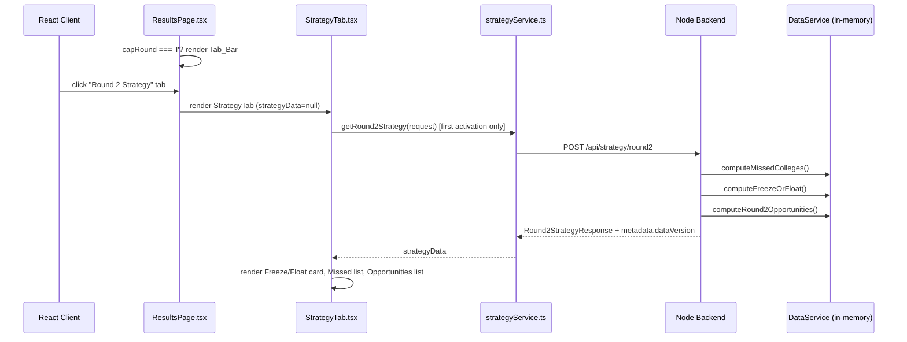
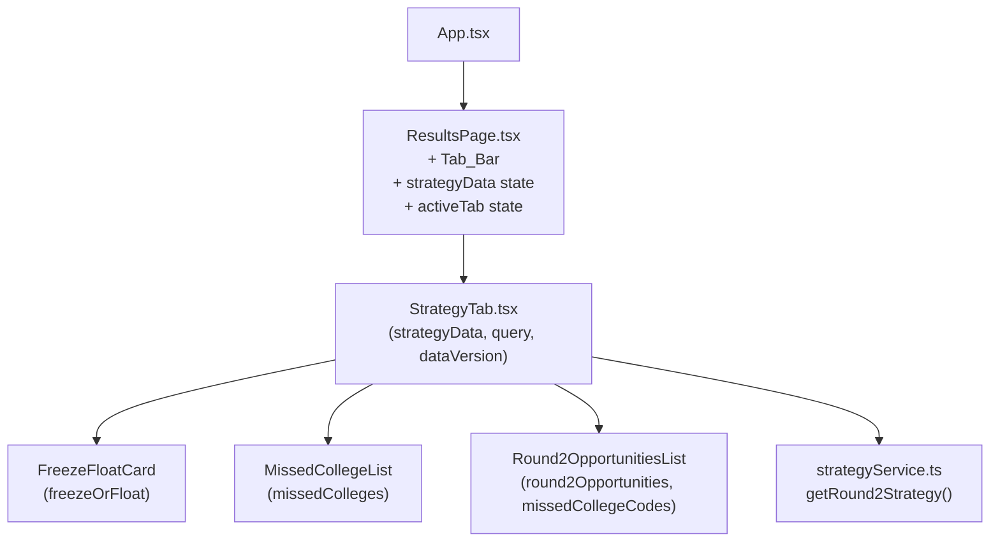

# Design Document: CAP Round 2 Strategy

## Overview

This feature adds a "CAP Round 2 Strategy" tab to the UniScout `ResultsPage`, visible only when the student has queried CAP Round I results. It surfaces three pieces of actionable intelligence derived from historical `cap_round_delta` data:

1. **Freeze or Float?** — a personalised recommendation on whether to accept the current best Round 1 offer or wait for Round 2.
2. **Missed in Round 1** — colleges the student narrowly missed in Round 1 that historically drop enough in Round 2 to fall within range.
3. **Round 2 Opportunities** — all colleges flagged with a Round 2 opportunity badge, sorted by expected cutoff drop.

A new backend endpoint `POST /api/strategy/round2` powers the analysis. The frontend renders the strategy as a dedicated tab on `ResultsPage`, shown only when `capRound === 'I'`.

**Cross-cutting constraints:**
- `resolveAdmissionProbability()` is imported from `src/lib/scoring.ts` — never redefined locally.
- All API response fields use camelCase.
- All API responses include `dataVersion` in metadata (e.g. `"2024-25"`).
- The frontend displays `dataVersion` subtly on the Strategy_Tab.

**What changes:**
- `src/components/ResultsPage.tsx` — Tab_Bar, lazy fetch, `StrategyTab` integration
- `src/components/StrategyTab.tsx` — new component
- `src/services/strategyService.ts` — new frontend API wrapper
- `src/services/api.ts` — new interfaces: `Round2StrategyRequest`, `MissedCollege`, `FreezeOrFloatResult`, `Round2Opportunity`, `Round2StrategyResponse`
- `backend-mhtcet/src/services/strategyService.ts` — new backend service
- `backend-mhtcet/src/controllers/strategyController.ts` — new controller
- `backend-mhtcet/src/routes/strategy.ts` — new route
- `backend-mhtcet/src/types/index.ts` — new strategy interfaces

**What stays the same:**
- All existing API routes and backend logic
- `CollegeRecommendation` interface (already extended by `enhanced-results-page`)
- State-based navigation pattern in `App.tsx`
- Dark glassmorphism design system tokens
- `src/lib/scoring.ts` shared scoring module

---


## Architecture



### Component Hierarchy



### Navigation and State

`ResultsPage` gains two new state variables:

```typescript
const [activeTab, setActiveTab] = useState<'results' | 'strategy'>('results');
const [strategyData, setStrategyData] = useState<Round2StrategyResponse | null>(null);
const [strategyLoading, setStrategyLoading] = useState(false);
const [strategyError, setStrategyError] = useState<string | null>(null);
const [dataVersion, setDataVersion] = useState<string | null>(null);
```

The Tab_Bar is rendered only when `capRound === 'I'`. Strategy data is fetched lazily on first tab activation and cached in `strategyData` state — subsequent activations skip the fetch.

---

## Components and Interfaces

### ResultsPage.tsx changes

```typescript
// Tab_Bar — rendered only when capRound === 'I'
{capRound === 'I' && (
  <div className="flex gap-2 mb-4" role="tablist">
    <button
      role="tab"
      aria-selected={activeTab === 'results'}
      aria-label="Results tab"
      onClick={() => setActiveTab('results')}
      className={activeTab === 'results' ? 'tab-active' : 'tab-inactive'}
    >
      Results
    </button>
    <button
      role="tab"
      aria-selected={activeTab === 'strategy'}
      aria-label="Round 2 Strategy tab"
      onClick={() => handleStrategyTabActivation()}
      className={activeTab === 'strategy' ? 'tab-active' : 'tab-inactive'}
    >
      Round 2 Strategy
    </button>
  </div>
)}

// Lazy fetch handler
const handleStrategyTabActivation = async () => {
  setActiveTab('strategy');
  if (strategyData !== null) return; // cached — skip fetch
  setStrategyLoading(true);
  setStrategyError(null);
  const controller = new AbortController();
  const timeout = setTimeout(() => controller.abort(), 10_000);
  try {
    const res = await strategyService.getRound2Strategy(
      { percentile, category, branch, colleges },
      controller.signal
    );
    setStrategyData(res.data);
    setDataVersion(res.metadata?.dataVersion ?? null);
  } catch (err) {
    setStrategyError(err instanceof Error && err.name === 'AbortError'
      ? 'Request timed out. Please retry.'
      : 'Failed to load strategy. Please retry.');
  } finally {
    clearTimeout(timeout);
    setStrategyLoading(false);
  }
};
```

### StrategyTab.tsx

```typescript
interface StrategyTabProps {
  strategyData: Round2StrategyResponse | null;
  loading: boolean;
  error: string | null;
  onRetry: () => void;
  dataVersion: string | null;
}
```

Layout (top to bottom):
1. `FreezeFloatCard` — prominent advisory card
2. `MissedCollegeList` — "Missed in Round 1" section
3. `Round2OpportunitiesList` — "Round 2 Opportunities" section
4. Subtle footer: `"Based on {dataVersion} CAP data"` (when `dataVersion` is non-null)

Loading state: three skeleton panels (one per section) using `animate-pulse` Tailwind classes.

Error state: inline error message + retry button with `aria-label="Retry loading strategy"`.

### FreezeFloatCard

```typescript
interface FreezeFloatCardProps {
  freezeOrFloat: FreezeOrFloatResult;
}
```

Renders:
- Large badge: `"Freeze"` (emerald) or `"Float"` (blue/cyan)
- `reasoning` string
- When `advice === 'Float'` and `betterOption` is present: summary card showing `betterOption.collegeName`, `betterOption.branch`, `historicalAvgRound2Cutoff`, `round2Probability`

### MissedCollegeList

```typescript
interface MissedCollegeListProps {
  missedColleges: MissedCollege[];
}
```

Each card shows: college name, branch, round1Cutoff, historicalAvgRound2Cutoff, `"↓ {expectedDrop} pts"`, round2Probability as `"{value}%"`. When `round2Probability >= 50`, renders a `"Good chance in Round 2"` badge with emerald accent.

Empty state: `"No colleges found within 8 points of your percentile with a historical Round 2 drop of 3+ points"`.

### Round2OpportunitiesList

```typescript
interface Round2OpportunitiesListProps {
  round2Opportunities: Round2Opportunity[];
  missedCollegeCodes: Set<string>; // for "Within your range" badge
}
```

Each row/card shows: college name, branch, round1Cutoff, historicalAvgRound2Cutoff, `"↓ {expectedDrop} pts"`. When `collegeCode` is in `missedCollegeCodes`, renders a `"Within your range"` badge.

Empty state: `"No colleges in your branch and category show a consistent Round 2 cutoff drop of 3+ points based on historical data."`.

### strategyService.ts (frontend)

```typescript
// src/services/strategyService.ts
import { api } from './api';
import type { Round2StrategyRequest, Round2StrategyResponse, ApiResponse } from './api';

export const strategyService = {
  async getRound2Strategy(
    request: Round2StrategyRequest,
    signal?: AbortSignal
  ): Promise<ApiResponse<Round2StrategyResponse>> {
    return api.getRound2Strategy(request, signal);
  },
};
```

---


## Data Models

### Frontend: `src/services/api.ts` additions

```typescript
export interface Round2StrategyRequest {
  percentile: number;
  category: string;
  branch: string;
  colleges: CollegeRecommendation[];
}

export interface MissedCollege {
  collegeName: string;
  branch: string;
  collegeCode: string;
  round1Cutoff: number;
  historicalAvgRound2Cutoff: number;
  expectedDrop: number;
  round2Probability: number;
}

export interface FreezeOrFloatResult {
  advice: 'Freeze' | 'Float';
  bestCurrentOption: {
    collegeName: string;
    branch: string;
    admissionBand: string;
  };
  reasoning: string;
  betterOption?: {
    collegeName: string;
    branch: string;
    historicalAvgRound2Cutoff: number;
    round2Probability: number;
  };
}

export interface Round2Opportunity {
  collegeName: string;
  branch: string;
  collegeCode: string;
  round1Cutoff: number;
  historicalAvgRound2Cutoff: number;
  expectedDrop: number;
  round2Opportunity: true;
}

export interface Round2StrategyResponse {
  missedColleges: MissedCollege[];
  freezeOrFloat: FreezeOrFloatResult;
  round2Opportunities: Round2Opportunity[];
}

// Added to api object:
// getRound2Strategy(request: Round2StrategyRequest, signal?: AbortSignal): Promise<ApiResponse<Round2StrategyResponse>>
```

`ApiResponse` metadata is extended to include `dataVersion`:

```typescript
export interface ApiResponse<T> {
  success: boolean;
  data?: T;
  message?: string;
  error?: string;
  metadata?: {
    totalResults?: number;
    query?: unknown;
    timestamp: string;
    ml_unavailable?: boolean;
    dataVersion?: string; // e.g. "2024-25"
  };
}
```

### Backend: `backend-mhtcet/src/types/index.ts` additions

```typescript
export interface Round2StrategyRequest {
  percentile: number;       // 0–100
  category: string;
  branch: string;
  colleges: CollegeRecommendation[];
}

export interface MissedCollege {
  collegeName: string;
  branch: string;
  collegeCode: string;
  round1Cutoff: number;
  historicalAvgRound2Cutoff: number;
  expectedDrop: number;
  round2Probability: number;
}

export interface FreezeOrFloatResult {
  advice: 'Freeze' | 'Float';
  bestCurrentOption: {
    collegeName: string;
    branch: string;
    admissionBand: string;
  };
  reasoning: string;
  betterOption?: {
    collegeName: string;
    branch: string;
    historicalAvgRound2Cutoff: number;
    round2Probability: number;
  };
}

export interface Round2Opportunity {
  collegeName: string;
  branch: string;
  collegeCode: string;
  round1Cutoff: number;
  historicalAvgRound2Cutoff: number;
  expectedDrop: number;
  round2Opportunity: true;
}

export interface Round2StrategyResponse {
  missedColleges: MissedCollege[];
  freezeOrFloat: FreezeOrFloatResult;
  round2Opportunities: Round2Opportunity[];
}
```

---

## Backend Service Design

### strategyService.ts

```typescript
// backend-mhtcet/src/services/strategyService.ts

import { dataService } from './dataService';
import { resolveAdmissionProbability } from '../utils/scoring';
import type {
  Round2StrategyRequest, MissedCollege, FreezeOrFloatResult,
  Round2Opportunity, Round2StrategyResponse, CollegeRecommendation
} from '../types/index';

const MISSED_COLLEGE_MAX_GAP = 8;       // percentile points above student
const MIN_HISTORICAL_DELTA = 3.0;       // minimum avg cap_round_delta to qualify
const MISSED_COLLEGE_LIMIT = 10;
const OPPORTUNITIES_LIMIT = 20;
const MIN_YEARS_DATA = 2;               // exclude combinations with < 2 years
const BETTER_OPTION_PRESTIGE_MARGIN = 5;
const BETTER_OPTION_PACKAGE_MARGIN = 1; // LPA
const BETTER_OPTION_MIN_PROBABILITY = 50;

/**
 * Computes the mean cap_round_delta for a (collegeCode, branchName, category) combination.
 * Returns null when fewer than MIN_YEARS_DATA years of paired data exist.
 */
function computeHistoricalAvgDelta(
  collegeCode: string,
  branchName: string,
  category: string
): number | null {
  const allRows = dataService.getAllColleges();
  // Find paired Round I / Round II rows for the same year
  const roundIRows = allRows.filter(r =>
    r.code === collegeCode && r.branch === branchName &&
    r.category === category && r.capRound === 'I'
  );
  const roundIIMap = new Map(
    allRows
      .filter(r => r.code === collegeCode && r.branch === branchName &&
        r.category === category && r.capRound === 'II')
      .map(r => [r.year, r.cutoffPercentile])
  );
  const deltas: number[] = [];
  for (const row of roundIRows) {
    const roundIICutoff = roundIIMap.get(row.year);
    if (roundIICutoff !== undefined) {
      deltas.push(row.cutoffPercentile - roundIICutoff);
    }
  }
  if (deltas.length < MIN_YEARS_DATA) return null;
  return deltas.reduce((s, d) => s + d, 0) / deltas.length;
}

/**
 * Computes round2Probability using the same sigmoid mapping as the ML_Service Predictor.
 * sigmoid(k * (percentile - expectedRound2Cutoff) / interval)
 * where interval = estimated from historical data (p90 - p10 of cutoffs, min epsilon).
 */
function computeRound2Probability(
  studentPercentile: number,
  expectedRound2Cutoff: number,
  cutoffInterval: number,
  k = 2.5
): number {
  const epsilon = 0.2;
  const interval = Math.max(cutoffInterval, epsilon);
  const z = k * (studentPercentile - expectedRound2Cutoff) / interval;
  const prob = 1 / (1 + Math.exp(-z));
  return Math.round(prob * 100);
}

export function computeMissedColleges(
  percentile: number,
  category: string,
  branch: string
): MissedCollege[] {
  const allRows = dataService.getAllColleges();
  // Get most recent Round I cutoffs per college for the given category+branch
  const latestRoundI = new Map<string, { cutoff: number; name: string; year: string }>();
  for (const row of allRows) {
    if (row.branch !== branch || row.category !== category || row.capRound !== 'I') continue;
    const existing = latestRoundI.get(row.code);
    if (!existing || row.year > existing.year) {
      latestRoundI.set(row.code, { cutoff: row.cutoffPercentile, name: row.name, year: row.year });
    }
  }

  const results: MissedCollege[] = [];
  for (const [collegeCode, { cutoff: round1Cutoff, name: collegeName }] of latestRoundI) {
    const gap = round1Cutoff - percentile;
    if (gap <= 0 || gap > MISSED_COLLEGE_MAX_GAP) continue;

    const avgDelta = computeHistoricalAvgDelta(collegeCode, branch, category);
    if (avgDelta === null || avgDelta < MIN_HISTORICAL_DELTA) continue;

    const historicalAvgRound2Cutoff = round1Cutoff - avgDelta;
    // Estimate interval from cutoff spread across years
    const cutoffs = allRows
      .filter(r => r.code === collegeCode && r.branch === branch &&
        r.category === category && r.capRound === 'I')
      .map(r => r.cutoffPercentile);
    const interval = cutoffs.length >= 2
      ? Math.max(...cutoffs) - Math.min(...cutoffs)
      : 2.0;

    const round2Probability = computeRound2Probability(
      percentile, historicalAvgRound2Cutoff, interval
    );

    results.push({
      collegeName,
      branch,
      collegeCode,
      round1Cutoff,
      historicalAvgRound2Cutoff,
      expectedDrop: avgDelta,
      round2Probability,
    });
  }

  return results
    .sort((a, b) => b.expectedDrop - a.expectedDrop)
    .slice(0, MISSED_COLLEGE_LIMIT);
}

const BAND_RANK: Record<string, number> = { Safe: 4, Likely: 3, Moderate: 2, Risky: 1 };
const CHANCE_RANK: Record<string, number> = { High: 4, Medium: 3, Low: 2 };

export function computeFreezeOrFloat(
  colleges: CollegeRecommendation[],
  missedColleges: MissedCollege[]
): FreezeOrFloatResult {
  if (colleges.length === 0) {
    return {
      advice: 'Freeze',
      bestCurrentOption: { collegeName: '', branch: '', admissionBand: '' },
      reasoning: 'No Round 1 results available to evaluate. Consider freezing any offer you hold.',
    };
  }

  // Identify Best_Round1_Option
  const best = colleges.reduce((prev, curr) => {
    const prevRank = prev.admissionBand
      ? (BAND_RANK[prev.admissionBand] ?? 0)
      : (CHANCE_RANK[prev.admissionChance] ?? 0);
    const currRank = curr.admissionBand
      ? (BAND_RANK[curr.admissionBand] ?? 0)
      : (CHANCE_RANK[curr.admissionChance] ?? 0);
    if (currRank > prevRank) return curr;
    if (currRank === prevRank) {
      return resolveAdmissionProbability(curr) > resolveAdmissionProbability(prev) ? curr : prev;
    }
    return prev;
  });

  const bestBand = best.admissionBand ?? (
    best.admissionChance === 'High' ? 'Safe' :
    best.admissionChance === 'Medium' ? 'Likely' : 'Moderate'
  );

  // Find Better_Option among missedColleges
  const bestPrestige = (best as any).college_prestige_score ?? 0;
  const bestPackage = parseFloat((best.avgPackage ?? '').replace(/[^0-9.]/g, '')) || null;

  const betterOption = missedColleges.find(mc => {
    if (mc.round2Probability < BETTER_OPTION_MIN_PROBABILITY) return false;
    const mcPrestige = (mc as any).college_prestige_score ?? 0;
    const mcPackage = parseFloat((mc as any).avgPackage?.replace(/[^0-9.]/g, '') ?? '') || null;
    const prestigeBetter = mcPrestige - bestPrestige > BETTER_OPTION_PRESTIGE_MARGIN;
    const packageBetter = mcPackage !== null && bestPackage !== null
      ? mcPackage - bestPackage > BETTER_OPTION_PACKAGE_MARGIN
      : false;
    return prestigeBetter || packageBetter;
  });

  if (betterOption) {
    return {
      advice: 'Float',
      bestCurrentOption: { collegeName: best.name, branch: best.branch, admissionBand: bestBand },
      reasoning: `Your best current option is ${best.name} (${bestBand}). In Round 2, ${betterOption.collegeName} typically drops to ${betterOption.historicalAvgRound2Cutoff.toFixed(2)}, which is within your range.`,
      betterOption: {
        collegeName: betterOption.collegeName,
        branch: betterOption.branch,
        historicalAvgRound2Cutoff: betterOption.historicalAvgRound2Cutoff,
        round2Probability: betterOption.round2Probability,
      },
    };
  }

  return {
    advice: 'Freeze',
    bestCurrentOption: { collegeName: best.name, branch: best.branch, admissionBand: bestBand },
    reasoning: `Your best current option is ${best.name} (${bestBand}). No significantly better college is likely to open in Round 2 within your range. Freezing is the safer choice.`,
  };
}

export function computeRound2Opportunities(
  category: string,
  branch: string
): Round2Opportunity[] {
  const allRows = dataService.getAllColleges();
  const latestRoundI = new Map<string, { cutoff: number; name: string; year: string }>();
  for (const row of allRows) {
    if (row.branch !== branch || row.category !== category || row.capRound !== 'I') continue;
    const existing = latestRoundI.get(row.code);
    if (!existing || row.year > existing.year) {
      latestRoundI.set(row.code, { cutoff: row.cutoffPercentile, name: row.name, year: row.year });
    }
  }

  const results: Round2Opportunity[] = [];
  for (const [collegeCode, { cutoff: round1Cutoff, name: collegeName }] of latestRoundI) {
    const avgDelta = computeHistoricalAvgDelta(collegeCode, branch, category);
    if (avgDelta === null || avgDelta < MIN_HISTORICAL_DELTA) continue;
    results.push({
      collegeName,
      branch,
      collegeCode,
      round1Cutoff,
      historicalAvgRound2Cutoff: round1Cutoff - avgDelta,
      expectedDrop: avgDelta,
      round2Opportunity: true,
    });
  }

  return results
    .sort((a, b) => b.expectedDrop - a.expectedDrop)
    .slice(0, OPPORTUNITIES_LIMIT);
}
```

### strategyController.ts

```typescript
// backend-mhtcet/src/controllers/strategyController.ts
import { Request, Response } from 'express';
import {
  computeMissedColleges,
  computeFreezeOrFloat,
  computeRound2Opportunities,
} from '../services/strategyService';

/**
 * POST /api/strategy/round2
 * Request: { percentile, category, branch, colleges? }
 * Response: { success: true, data: Round2StrategyResponse, metadata: { dataVersion, timestamp } }
 */
export async function getRound2Strategy(req: Request, res: Response): Promise<void> {
  const { percentile, category, branch, colleges = [] } = req.body;

  if (!category || !branch) {
    const missing = [!category && 'category', !branch && 'branch'].filter(Boolean);
    res.status(400).json({ success: false, error: `Missing required fields: ${missing.join(', ')}` });
    return;
  }
  if (typeof percentile !== 'number' || percentile < 0 || percentile > 100) {
    res.status(422).json({ success: false, error: 'percentile must be a number between 0 and 100' });
    return;
  }

  try {
    const missedColleges = computeMissedColleges(percentile, category, branch);
    const freezeOrFloat = computeFreezeOrFloat(colleges, missedColleges);
    const round2Opportunities = computeRound2Opportunities(category, branch);

    res.status(200).json({
      success: true,
      data: { missedColleges, freezeOrFloat, round2Opportunities },
      metadata: {
        dataVersion: process.env.DATA_VERSION ?? '2024-25',
        timestamp: new Date().toISOString(),
      },
    });
  } catch (err) {
    console.error('strategyController error', { percentile, category, branch, err });
    res.status(500).json({ success: false, error: 'Internal server error computing Round 2 strategy' });
  }
}
```

### routes/strategy.ts

```typescript
// backend-mhtcet/src/routes/strategy.ts
import { Router } from 'express';
import { getRound2Strategy } from '../controllers/strategyController';

const router = Router();

/** POST /api/strategy/round2 — compute Round 2 strategy analysis */
router.post('/round2', getRound2Strategy);

export default router;
```

Registered in `server.ts`:

```typescript
import strategyRouter from './routes/strategy';
app.use('/api/strategy', strategyRouter);
```

---


## Correctness Properties

*A property is a characteristic or behavior that should hold true across all valid executions of a system — essentially, a formal statement about what the system should do. Properties serve as the bridge between human-readable specifications and machine-verifiable correctness guarantees.*

### Property 1: Tab_Bar visibility is exactly correlated with capRound

*For any* `capRound` value, the Tab_Bar should be present in the rendered `ResultsPage` DOM if and only if `capRound === 'I'`. For all other values (`'II'`, `'III'`, or any arbitrary string), the Tab_Bar should be absent.

**Validates: Requirements 1.1, 1.2**

---

### Property 2: Tab switching is a round-trip

*For any* `ResultsPage` in the "Results" tab state, switching to the "Round 2 Strategy" tab and then back to the "Results" tab should restore the exact same visible content (college cards grid, stats bar, filter controls) and hide the Strategy_Tab content.

**Validates: Requirements 1.3, 1.4**

---

### Property 3: Strategy fetch is called at most once per session

*For any* number of activations of the "Round 2 Strategy" tab within a single results session, the `POST /api/strategy/round2` endpoint should be called exactly once. All subsequent activations should use the cached `strategyData` without triggering a new network request.

**Validates: Requirements 2.2**

---

### Property 4: Missed college filter bounds

*For any* student percentile and in-memory dataset, every college in the `missedColleges` response array must satisfy both conditions simultaneously: `round1Cutoff - percentile > 0` AND `round1Cutoff - percentile <= 8` AND `historicalAvgDelta >= 3.0`. No college outside these bounds should appear in the list.

**Validates: Requirements 3.1**

---

### Property 5: Missed college list size invariant

*For any* valid request, the `missedColleges` array in the response should never exceed 10 entries, and the `round2Opportunities` array should never exceed 20 entries.

**Validates: Requirements 3.6, 5.7**

---

### Property 6: Strategy response lists are sorted by expectedDrop descending

*For any* valid request, both `missedColleges` and `round2Opportunities` in the response should be sorted such that `expectedDrop[i] >= expectedDrop[i+1]` for all consecutive pairs. The largest expected drop appears first.

**Validates: Requirements 3.4, 5.3**

---

### Property 7: Strategy response items contain all required fields

*For any* valid request, every item in `missedColleges` should have non-null values for `collegeName`, `branch`, `collegeCode`, `round1Cutoff`, `historicalAvgRound2Cutoff`, `expectedDrop`, and `round2Probability`. Every item in `round2Opportunities` should have non-null values for `collegeName`, `branch`, `collegeCode`, `round1Cutoff`, `historicalAvgRound2Cutoff`, `expectedDrop`, and `round2Opportunity === true`.

**Validates: Requirements 3.2, 5.2**

---

### Property 8: Best_Round1_Option ranking respects band hierarchy

*For any* `colleges` array, `computeFreezeOrFloat` should identify the `bestCurrentOption` as the college with the highest `admissionBand` rank (Safe > Likely > Moderate > Risky), breaking ties by `resolveAdmissionProbability()` descending. When `admissionBand` is absent for all colleges, the ranking should fall back to `admissionChance` (High → Safe-equivalent, Medium → Likely-equivalent, Low → Moderate-equivalent).

**Validates: Requirements 4.1, 9.2**

---

### Property 9: Freeze/Float advice logic

*For any* input where the `bestCurrentOption` has `admissionBand` of "Safe" or "Likely" and no `betterOption` qualifies, the `advice` should be `"Freeze"`. For any input where at least one college in `missedColleges` has `college_prestige_score > bestOption.prestige + 5` OR `avgPackage > bestOption.avgPackage + 1 LPA`, AND `round2Probability >= 50`, the `advice` should be `"Float"`.

**Validates: Requirements 4.2, 4.3**

---

### Property 10: freezeOrFloat reasoning string format

*For any* response with `advice === 'Float'`, the `reasoning` string should contain the `bestCurrentOption.collegeName`, the `bestCurrentOption.admissionBand`, the `betterOption.collegeName`, and the `betterOption.historicalAvgRound2Cutoff`. For any response with `advice === 'Freeze'`, the `reasoning` string should contain the `bestCurrentOption.collegeName` and the `bestCurrentOption.admissionBand`.

**Validates: Requirements 4.5, 4.6**

---

### Property 11: Round 2 Opportunities contain only qualifying colleges

*For any* valid request, every college in `round2Opportunities` should have `round2Opportunity === true` (i.e. `historicalAvgDelta >= 3.0`) and should match the requested `category` and `branch`. No college with fewer than 2 years of paired Round I/II data should appear in either `missedColleges` or `round2Opportunities`.

**Validates: Requirements 5.1, 9.1**

---

### Property 12: "Within your range" badge tracks missedColleges membership

*For any* rendered `Round2OpportunitiesList`, a college entry should display the "Within your range" badge if and only if its `collegeCode` also appears in the `missedColleges` array from the same strategy response.

**Validates: Requirements 5.6**

---

### Property 13: round2Probability is bounded in [0, 100]

*For any* student percentile and expected Round 2 cutoff, `computeRound2Probability` should return a value in the integer range [0, 100]. The sigmoid mapping ensures this: as `percentile → +∞`, probability → 100; as `percentile → -∞`, probability → 0.

**Validates: Requirements 3.2, 6.1**

---

### Property 14: Validation errors for out-of-range percentile

*For any* request where `percentile < 0` or `percentile > 100`, the Strategy_Endpoint should return HTTP 422 with a descriptive error message. For any request missing `category` or `branch`, it should return HTTP 400.

**Validates: Requirements 6.2, 6.3**

---

### Property 15: avgPackage-absent Better_Option uses prestige only

*For any* input where `avgPackage` is null or absent for both the `bestCurrentOption` and a `betterOption` candidate, `computeFreezeOrFloat` should only use `college_prestige_score` to determine whether the candidate qualifies as a Better_Option. It should not produce `Float` advice based on package data alone when package data is unavailable.

**Validates: Requirements 9.4**

---

### Property 16: Accessible labels on all interactive elements

*For any* rendered `StrategyTab`, every interactive element (retry button, tab buttons, sort controls) should have a non-empty `aria-label` attribute or an associated `<label>` element, ensuring screen reader users can identify each element's purpose.

**Validates: Requirements 8.6**

---

## Error Handling

| Scenario | Behaviour |
|---|---|
| `percentile` outside [0, 100] | HTTP 422 with descriptive validation error |
| `category` or `branch` absent | HTTP 400 listing missing fields |
| `colleges` absent in request body | Treated as empty array; `freezeOrFloat.advice` defaults to "Freeze" |
| College-branch-category has < 2 years of paired data | Excluded from all output lists silently |
| All `admissionBand` fields absent | Falls back to `admissionChance` ranking for Best_Round1_Option |
| `avgPackage` unavailable for both options | Better_Option qualification uses prestige only |
| Student percentile above all cutoffs | `missedColleges: []`, `freezeOrFloat.advice: 'Freeze'` with appropriate reasoning |
| Strategy_Service throws unexpected error | HTTP 500 with structured error; input params logged; no partial response |
| Frontend: Strategy_Endpoint returns non-200 | Inline error message + retry button shown in Strategy_Tab |
| Frontend: Strategy_Endpoint times out (>10s) | Request aborted; timeout message + retry button shown |
| Frontend: Retry after error | `strategyData` reset to null; fetch re-triggered |

---

## Testing Strategy

### Dual Testing Approach

Both unit tests and property-based tests are required. Unit tests cover specific examples, integration points, and edge cases. Property tests verify universal correctness across randomised inputs using **fast-check** (TypeScript). Each property test runs a minimum of 100 iterations.

### Unit Tests

**`strategyService.test.ts`** (pure functions):
- `computeHistoricalAvgDelta`: returns null when < 2 years of paired data; returns correct mean when ≥ 2 years
- `computeMissedColleges`: excludes colleges where gap > 8 pts; excludes colleges where avgDelta < 3.0; limits to 10 entries; sorts by expectedDrop desc
- `computeFreezeOrFloat`: empty colleges → Freeze with default reasoning; Safe best option + no better → Freeze; qualifying better option → Float with correct reasoning format; admissionBand absent → falls back to admissionChance
- `computeRound2Opportunities`: only includes colleges with avgDelta >= 3.0; limits to 20 entries; sorts by expectedDrop desc
- `computeRound2Probability`: returns 50 when percentile equals expectedRound2Cutoff; returns > 50 when percentile > cutoff; returns < 50 when percentile < cutoff; always in [0, 100]

**`strategyController.test.ts`**:
- Missing `category` → HTTP 400 listing "category"
- Missing `branch` → HTTP 400 listing "branch"
- `percentile: -1` → HTTP 422
- `percentile: 101` → HTTP 422
- Absent `colleges` field → treated as empty array, returns Freeze advice
- Valid request → HTTP 200 with `success: true` and all three data sections
- Service throws → HTTP 500 with structured error

**`StrategyTab.test.tsx`**:
- Loading state → three skeleton panels visible, no data sections
- Error state → error message and retry button visible with aria-label
- Successful data → FreezeFloatCard, MissedCollegeList, Round2OpportunitiesList rendered in order
- `dataVersion` present → footer "Based on 2024-25 CAP data" visible
- Empty `missedColleges` → empty state message rendered
- Empty `round2Opportunities` → empty state message rendered

**`MissedCollegeList.test.tsx`**:
- `round2Probability >= 50` → "Good chance in Round 2" badge present with emerald class
- `round2Probability < 50` → badge absent
- `expectedDrop` formatted as `"↓ {value} pts"`

**`Round2OpportunitiesList.test.tsx`**:
- College in `missedCollegeCodes` → "Within your range" badge present
- College not in `missedCollegeCodes` → badge absent

### Property-Based Tests (fast-check)

```typescript
// Feature: cap-round2-strategy, Property 4: Missed college filter bounds
fc.assert(fc.property(
  fc.float({ min: 0, max: 100 }),
  fc.array(arbitraryCollegeRow()),
  (percentile, dataset) => {
    const missed = computeMissedColleges(percentile, 'OPEN', 'Computer Engineering', dataset);
    return missed.every(mc => {
      const gap = mc.round1Cutoff - percentile;
      return gap > 0 && gap <= 8 && mc.expectedDrop >= 3.0;
    });
  }
), { numRuns: 200 });

// Feature: cap-round2-strategy, Property 5: List size invariants
fc.assert(fc.property(
  fc.float({ min: 0, max: 100 }),
  fc.array(arbitraryCollegeRow()),
  (percentile, dataset) => {
    const missed = computeMissedColleges(percentile, 'OPEN', 'Computer Engineering', dataset);
    const opps = computeRound2Opportunities('OPEN', 'Computer Engineering', dataset);
    return missed.length <= 10 && opps.length <= 20;
  }
), { numRuns: 100 });

// Feature: cap-round2-strategy, Property 6: Lists sorted by expectedDrop descending
fc.assert(fc.property(
  fc.float({ min: 0, max: 100 }),
  fc.array(arbitraryCollegeRow(), { minLength: 1 }),
  (percentile, dataset) => {
    const missed = computeMissedColleges(percentile, 'OPEN', 'Computer Engineering', dataset);
    const opps = computeRound2Opportunities('OPEN', 'Computer Engineering', dataset);
    const isSorted = (arr: { expectedDrop: number }[]) =>
      arr.every((item, i) => i === 0 || arr[i - 1].expectedDrop >= item.expectedDrop);
    return isSorted(missed) && isSorted(opps);
  }
), { numRuns: 100 });

// Feature: cap-round2-strategy, Property 8: Best_Round1_Option ranking
fc.assert(fc.property(
  fc.array(arbitraryCollegeRecommendation(), { minLength: 1 }),
  (colleges) => {
    const result = computeFreezeOrFloat(colleges, []);
    const best = colleges.find(c => c.name === result.bestCurrentOption.collegeName);
    if (!best) return false;
    return colleges.every(c => {
      const bestRank = BAND_RANK[best.admissionBand ?? ''] ?? CHANCE_RANK[best.admissionChance] ?? 0;
      const cRank = BAND_RANK[c.admissionBand ?? ''] ?? CHANCE_RANK[c.admissionChance] ?? 0;
      return cRank <= bestRank;
    });
  }
), { numRuns: 100 });

// Feature: cap-round2-strategy, Property 13: round2Probability bounded in [0, 100]
fc.assert(fc.property(
  fc.float({ min: 0, max: 100 }),
  fc.float({ min: 0, max: 100 }),
  fc.float({ min: 0.1, max: 20 }),
  (percentile, cutoff, interval) => {
    const prob = computeRound2Probability(percentile, cutoff, interval);
    return prob >= 0 && prob <= 100;
  }
), { numRuns: 200 });

// Feature: cap-round2-strategy, Property 11: Opportunities contain only qualifying colleges
fc.assert(fc.property(
  fc.array(arbitraryCollegeRow()),
  (dataset) => {
    const opps = computeRound2Opportunities('OPEN', 'Computer Engineering', dataset);
    return opps.every(o => o.round2Opportunity === true && o.expectedDrop >= 3.0);
  }
), { numRuns: 100 });

// Feature: cap-round2-strategy, Property 14: Validation errors for out-of-range percentile
fc.assert(fc.property(
  fc.oneof(
    fc.float({ max: -0.01 }),
    fc.float({ min: 100.01 })
  ),
  async (percentile) => {
    const res = await request(app)
      .post('/api/strategy/round2')
      .send({ percentile, category: 'OPEN', branch: 'Computer Engineering' });
    return res.status === 422;
  }
), { numRuns: 100 });
```

### Property Test Configuration

- Library: **fast-check** (`npm install --save-dev fast-check`)
- Minimum iterations: 100 per property test (200 for critical filter/bounds tests)
- Each test tagged with: `// Feature: cap-round2-strategy, Property N: <property_text>`
- Each correctness property is implemented by exactly one property-based test
