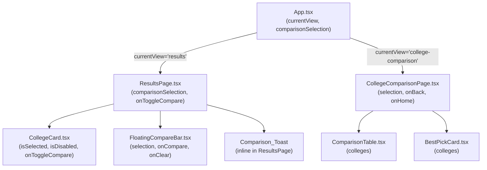

# Design Document: College Comparison

## Overview

This feature adds a side-by-side college comparison capability to the UniScout MHT-CET platform. Students select 2–3 colleges from the existing `ResultsPage` using per-card checkboxes, then navigate to a dedicated `CollegeComparisonPage` that renders a scrollable metric table and a "Best Pick" recommendation card.

All computation is client-side — every field needed (admission probability, packages, fees, prestige) is already present in the `CollegeRecommendation` objects returned by the API. No new API endpoints are required.

**What changes:**
- `src/services/api.ts` — no interface changes needed; all required fields already added by `enhanced-results-page` spec
- `src/App.tsx` — new `'college-comparison'` nav state, `comparisonSelection` state variable
- `src/components/ResultsPage.tsx` — `comparisonSelection` / `onToggleCompare` props, bottom padding, `FloatingCompareBar` integration
- `src/components/CollegeCard.tsx` (extracted from `ResultsPage.tsx`) — `Compare_Checkbox` added to collapsed face
- `src/components/CollegeComparisonPage.tsx` — new page component
- `src/components/ComparisonTable.tsx` — new table component
- `src/components/BestPickCard.tsx` — new recommendation card component
- `src/components/FloatingCompareBar.tsx` — new fixed-bottom bar component

**What stays the same:**
- All existing API routes and backend logic
- `CollegeRecommendation` interface (already extended by `enhanced-results-page`)
- State-based navigation pattern in `App.tsx`
- Dark glassmorphism design system tokens

---

## Architecture



### Navigation State Machine

```
home → mht-cet → results ⇄ college-comparison
                 results → home
                 college-comparison → home
```

`comparisonSelection` persists across the `results ⇄ college-comparison` transition. It is cleared only when navigating to `home`.

### Data Flow

All comparison data flows from `App.tsx` state downward as props. No context or external state library is introduced.

```
App.comparisonSelection: CollegeRecommendation[]
  → ResultsPage (read + mutate via callbacks)
  → CollegeComparisonPage (read-only)
    → ComparisonTable (read-only)
    → BestPickCard (read-only, computes weighted scores internally)
```

---

## Components and Interfaces

### App.tsx changes

```typescript
// Extended nav state type
export type Portal = 'home' | 'mht-cet' | 'ssc' | 'results' | 'college-comparison';

// New state variable
const [comparisonSelection, setComparisonSelection] = useState<CollegeRecommendation[]>([]);

// Handlers
const handleToggleCompare = (college: CollegeRecommendation) => {
  setComparisonSelection(prev => {
    const isSelected = prev.some(c => c.id === college.id);
    if (isSelected) return prev.filter(c => c.id !== college.id);
    if (prev.length >= 3) return prev; // toast shown in ResultsPage
    return [...prev, college];
  });
};

const handleOpenComparison = () => setCurrentView('college-comparison');

const handleBackFromComparison = () => setCurrentView('results');
// Does NOT clear comparisonSelection or colleges array

const handleHomeFromComparison = () => {
  setCurrentView('home');
  setComparisonSelection([]);
};
```

Render branch added:
```tsx
{currentView === 'college-comparison' && (
  <CollegeComparisonPage
    selection={comparisonSelection}
    onBack={handleBackFromComparison}
    onHome={handleHomeFromComparison}
  />
)}
```

`ResultsPage` gains two new props:
```tsx
<ResultsPage
  colleges={colleges}
  portalType={portalType}
  onBack={handleBackToPortal}
  onHome={handleBackToHome}
  comparisonSelection={comparisonSelection}
  onToggleCompare={handleToggleCompare}
  onOpenComparison={handleOpenComparison}
/>
```

---

### FloatingCompareBar.tsx

Fixed-position bar rendered at the bottom of the viewport when `selection.length >= 1`.

```typescript
interface FloatingCompareBarProps {
  selection: CollegeRecommendation[];
  onCompare: () => void;
  onClear: () => void;
}
```

Key behaviours:
- `z-index: 50` (Tailwind `z-50`) — above all cards
- `position: fixed; bottom: 0` — always visible
- "Compare (N)" label where N = `selection.length`
- "Compare" button: enabled when `selection.length >= 2`, disabled (opacity-50, cursor-not-allowed) when `selection.length === 1`
- Hint text "Select 1 or 2 more to compare" shown when `selection.length === 1`
- "Clear" button always visible when bar is rendered
- Not rendered when `selection.length === 0`

`ResultsPage` adds `pb-28` (bottom padding) to its `<main>` element when `selection.length > 0` to prevent the bar from obscuring the last card.

---

### CollegeCard.tsx (extracted + modified)

`CollegeCard` is extracted from `ResultsPage.tsx` into its own file to keep concerns separate.

```typescript
interface CollegeCardProps {
  college: CollegeRecommendation;
  delay: number;
  isExpanded: boolean;
  onToggle: () => void;
  // New comparison props
  isSelected: boolean;
  isDisabled: boolean;       // true when selection is full and this card is not selected
  onToggleCompare: (college: CollegeRecommendation) => void;
}
```

The `Compare_Checkbox` is rendered in the collapsed card face (top-right area, alongside the location badge). It uses a `<button>` with `role="checkbox"` and `aria-checked={isSelected}` for accessibility.

```tsx
<button
  role="checkbox"
  aria-checked={isSelected}
  aria-label={`Compare ${college.name}`}
  onClick={(e) => {
    e.stopPropagation(); // prevent card expand/collapse
    onToggleCompare(college);
  }}
  disabled={isDisabled}
  className={`...`}
>
  {isSelected ? <CheckSquare className="w-4 h-4" /> : <Square className="w-4 h-4" />}
</button>
```

`e.stopPropagation()` ensures the checkbox click does not bubble to the card's `onClick` (expand/collapse).

---

### Comparison_Toast

Inline component within `ResultsPage.tsx`. Shown for 3 seconds when a 4th college is attempted.

```typescript
// State in ResultsPage
const [showToast, setShowToast] = useState(false);

// Triggered in onToggleCompare when selection.length === 3 and college not selected
// Uses useEffect with setTimeout for auto-dismiss
```

Rendered using `AnimatePresence` + Framer Motion slide-up animation, fixed bottom-right, `z-60`.

---

### CollegeComparisonPage.tsx

```typescript
interface CollegeComparisonPageProps {
  selection: CollegeRecommendation[];
  onBack: () => void;
  onHome: () => void;
}
```

Layout:
1. Sticky header with "Back to Results" and "Home" buttons
2. Page title "Compare Colleges"
3. `<ComparisonTable colleges={selection} />`
4. `<BestPickCard colleges={selection} />`

---

### ComparisonTable.tsx

```typescript
interface ComparisonTableProps {
  colleges: CollegeRecommendation[]; // 2 or 3 items
}
```

The table uses CSS Grid (not `<table>`) for easier sticky column support:

```
grid-template-columns: 180px repeat(N, minmax(200px, 1fr))
```

- First column: sticky left (`sticky left-0 z-10 bg-slate-900/80 backdrop-blur`) — metric labels
- Header row: sticky top (`sticky top-[header-height] z-20`) — college names
- Horizontal scroll: `overflow-x-auto` on the wrapper div

**12 metric rows in order:**

| # | Row Label | Source Field | Best-Value Logic |
|---|-----------|-------------|-----------------|
| 1 | College & Type | `name`, `collegeType` | — |
| 2 | Location | `location`, `district` | — |
| 3 | Branch | `branch` | — |
| 4 | Cutoff Percentile | `cutoffPercentile` | lowest (min) |
| 5 | Cutoff Trend | `cutoffTrend` | — |
| 6 | Admission Band | `admissionBand` / `admissionChance` | highest probability |
| 7 | Fees | `fees` | lowest parsed annual fee |
| 8 | Seats | `seats` | — |
| 9 | Avg Package | `avgPackage` | highest |
| 10 | Highest Package | `highestPackage` | highest |
| 11 | ROI Score | computed | highest |
| 12 | Round 2 Opportunity | `round2Opportunity` | — |

**Best-value highlighting:** cells with the best value in quantitative rows get a `ring-2 ring-cyan-400/60 bg-cyan-500/10` accent. Ties share the highlight.

**Null handling:** any absent/null field renders `"—"` via a `formatCell` helper.

---

### BestPickCard.tsx

```typescript
interface BestPickCardProps {
  colleges: CollegeRecommendation[]; // 2 or 3 items
}
```

All scoring logic lives in this component (or a co-located `scoring.ts` utility).

---

## Shared Scoring Module

All scoring logic across UniScout features (Results sorting, Comparison, Form Filling, Strategy) is centralised in a single shared module to ensure consistency. The same college never ranks differently across features due to divergent weight definitions.

### Frontend: `src/lib/scoring.ts`

```typescript
/**
 * Shared scoring utilities used by CollegeComparisonPage, SmartFormPage,
 * and ResultsPage sorting. All features import from this module — never
 * define weights locally.
 */

/** Weights used in the weighted score formula. Configurable — not hardcoded constants. */
export interface ScoringWeights {
  admissionProbability: number; // default 0.5
  avgPackage: number;           // default 0.3
  prestige: number;             // default 0.2
}

export const DEFAULT_WEIGHTS: ScoringWeights = {
  admissionProbability: 0.5,
  avgPackage: 0.3,
  prestige: 0.2,
};

/** Fallback weights when avgPackage is null for ALL colleges in the set */
export const FALLBACK_WEIGHTS_NO_PACKAGE: ScoringWeights = {
  admissionProbability: 0.7,
  avgPackage: 0,
  prestige: 0.3,
};

/** Prestige score mapping by collegeType */
export const PRESTIGE_SCORES: Record<string, number> = {
  'Government Autonomous': 1.0,
  'Government': 0.85,
  'Private Aided': 0.6,
  'Private Unaided': 0.4,
};
export const PRESTIGE_DEFAULT = 0.3;

/**
 * Resolves admission probability (0–1) from a CollegeRecommendation.
 * Uses ML midpoint when available; falls back to admissionChance approximation.
 * Single source of truth — used by ALL features.
 */
export function resolveAdmissionProbability(college: CollegeRecommendation): number {
  if (college.admissionProbabilityP10 != null && college.admissionProbabilityP90 != null) {
    return (college.admissionProbabilityP10 + college.admissionProbabilityP90) / 200;
  }
  const CHANCE_TO_PROBABILITY: Record<string, number> = {
    High: 0.85, Medium: 0.50, Low: 0.15,
  };
  return CHANCE_TO_PROBABILITY[college.admissionChance] ?? 0.5;
}

/**
 * Generates a human-readable reason string from the top 2 dominant scoring factors.
 * Used by BestPickCard, PreferenceEntryCard, and CollegeCard (expanded view).
 */
export function generateEntryReason(
  admissionProbability: number,
  normalizedAvgPackage: number,
  normalizedPrestige: number,
  weights: ScoringWeights = DEFAULT_WEIGHTS
): string {
  const contributions = [
    { key: 'prob', value: admissionProbability * weights.admissionProbability, label: 'High admission probability' },
    { key: 'placement', value: normalizedAvgPackage * weights.avgPackage, label: 'Strong placement record' },
    { key: 'prestige', value: normalizedPrestige * weights.prestige, label: 'Strong college reputation' },
  ];
  const top2 = contributions.sort((a, b) => b.value - a.value).slice(0, 2).filter(c => c.value > 0);
  if (top2.length === 0 || (top2[0].key === 'prob' && admissionProbability < 0.2)) {
    return 'Best available option in your range';
  }
  return top2.map(f => f.label).join(' + ');
}

export function computeWeightedScore(
  admissionProbability: number,
  normalizedAvgPackage: number,
  normalizedPrestige: number,
  weights: ScoringWeights = DEFAULT_WEIGHTS
): number {
  return (
    admissionProbability * weights.admissionProbability +
    normalizedAvgPackage * weights.avgPackage +
    normalizedPrestige * weights.prestige
  );
}
```

### Backend: `backend-mhtcet/src/utils/scoring.ts`

Mirrors the frontend module for use in `formFillingService.ts` and `strategyService.ts`. Weights are read from env vars with the same defaults.

```typescript
export const SCORING_WEIGHTS = {
  admissionProbability: parseFloat(process.env.SCORING_WEIGHT_PROB ?? '0.5'),
  avgPackage: parseFloat(process.env.SCORING_WEIGHT_PLACEMENT ?? '0.3'),
  prestige: parseFloat(process.env.SCORING_WEIGHT_PRESTIGE ?? '0.2'),
};

// Validate weights sum to 1.0 at startup; log warning and normalise if not
```

### Environment Variables (shared, backend)

```
SCORING_WEIGHT_PROB=0.5
SCORING_WEIGHT_PLACEMENT=0.3
SCORING_WEIGHT_PRESTIGE=0.2
```

These replace the feature-specific `FORM_FILLING_WEIGHT_*` variables. The form filling feature's additional weights (location, branch rank) are additive on top of the shared base and remain feature-specific.

---

## API Response Conventions

All API responses across UniScout use **camelCase** field names consistently. The following canonical names are locked:

| Concept | Canonical field name |
|---|---|
| College average package | `avgPackage` |
| College highest package | `highestPackage` |
| Cutoff percentile | `cutoffPercentile` |
| Admission probability (P10) | `admissionProbabilityP10` |
| Admission probability (P90) | `admissionProbabilityP90` |
| Admission band | `admissionBand` |
| Confidence label | `confidenceLabel` |
| Top factors | `topFactors` |
| Cutoff trend | `cutoffTrend` |
| Round 2 opportunity | `round2Opportunity` |
| ML unavailable flag | `ml_unavailable` (exception: snake_case for metadata flags) |
| Data version | `dataVersion` |

The ML service (Python) uses snake_case internally. The Node.js backend maps all ML response fields to camelCase before returning them to the frontend.

---

## Data Freshness Metadata

All API responses include a `dataVersion` field in their metadata to indicate which dataset version was used. This allows the frontend to display "Based on 2024–25 CAP data" to students.

```typescript
// Added to ALL API response metadata objects
metadata: {
  dataVersion: string;   // e.g. "2024-25" — set from DATA_VERSION env var
  // ... other metadata fields
}
```

Backend env var: `DATA_VERSION=2024-25`

The frontend displays this in a subtle footer on the Results page, College Detail page, and Smart Form page: "Predictions based on {dataVersion} CAP data."

---

## UI Information Hierarchy

To prevent visual overload, each surface shows only the most relevant information at each level of detail:

| Surface | Primary info | Secondary info (on expand/hover) |
|---|---|---|
| College Card (collapsed) | Admission band + probability range | — |
| College Card (expanded) | Cutoff trend, fees, seats | Confidence label, top factors |
| College Detail Page | Chances section + cutoff chart | Placement, Round 2 strategy |
| Comparison Table | All metrics side-by-side | Best Pick reason |
| Preference Entry (Form Filling) | Rank, name, band, entryReason | Cutoff, fees, probability % |

The rule: **never show probability range + confidence label + top factors + trend + placement all at once on a collapsed card**. Collapsed cards show band + probability range only. Everything else is behind expand/detail.

---

```typescript
// src/components/comparison/types.ts

/** Weights used in the weighted score formula. Configurable — not hardcoded constants. */
export interface ComparisonWeights {
  admissionProbability: number; // default 0.5
  avgPackage: number;           // default 0.3
  prestige: number;             // default 0.2
}

export const DEFAULT_WEIGHTS: ComparisonWeights = {
  admissionProbability: 0.5,
  avgPackage: 0.3,
  prestige: 0.2,
};

/** Fallback weights when avgPackage is null for ALL colleges */
export const FALLBACK_WEIGHTS_NO_PACKAGE: ComparisonWeights = {
  admissionProbability: 0.7,
  avgPackage: 0,
  prestige: 0.3,
};

/** Prestige score mapping by collegeType */
export const PRESTIGE_SCORES: Record<string, number> = {
  'Government Autonomous': 1.0,
  'Government': 0.85,
  'Private Aided': 0.6,
  'Private Unaided': 0.4,
};
export const PRESTIGE_DEFAULT = 0.3;

/** Result of weighted score computation for a single college */
export interface ScoredCollege {
  college: CollegeRecommendation;
  weightedScore: number;
  admissionProbability: number;   // resolved value (ML or approximated)
  normalizedAvgPackage: number;   // 0–1
  normalizedPrestige: number;     // 0–1
  dominantFactors: string[];      // top 2 human-readable factor strings
}

/** Result of the best-pick computation */
export interface BestPickResult {
  winners: ScoredCollege[];       // length 1 normally, >1 on tie
  isTie: boolean;
  entryReason: string;            // human-readable explanation
}
```

### Admission probability resolution

```typescript
// Import from shared module — do NOT redefine locally
import { resolveAdmissionProbability } from '../lib/scoring';
```
```

### Fees parsing

```typescript
/**
 * Parses the fees string from CollegeRecommendation into an annual LPA figure.
 * Handles formats like "₹1,20,000", "1.2 LPA", "4.8 LPA (total)", "₹4,80,000 (4 years)".
 * When the value appears to be a total 4-year cost (> 5 LPA threshold or explicit "4 year" hint),
 * divides by 4 to get annual fees.
 */
function parseAnnualFees(fees: string): number | null
```

### Package parsing

```typescript
/**
 * Parses avgPackage / highestPackage strings like "₹6.5 LPA", "6.5", "6.5 LPA" into a number.
 * Returns null if unparseable.
 */
function parsePackageLPA(pkg: string | null | undefined): number | null
```

### Weighted score computation

```typescript
// Import from shared module — do NOT redefine locally
import { computeWeightedScore, generateEntryReason, DEFAULT_WEIGHTS, FALLBACK_WEIGHTS_NO_PACKAGE } from '../lib/scoring';

function computeWeightedScores(
  colleges: CollegeRecommendation[],
  weights = DEFAULT_WEIGHTS
): ScoredCollege[]

function computeBestPick(colleges: CollegeRecommendation[]): BestPickResult
```

**Algorithm:**

1. Resolve `admissionProbability` for each college (ML or approximated).
2. Parse `avgPackage` for each college. If ALL are null → use `FALLBACK_WEIGHTS_NO_PACKAGE`.
3. Compute `maxPackage = max(parsedPackages)`. `normalizedAvgPackage = parsedPackage / maxPackage` (0 for null).
4. Compute `normalizedPrestige = PRESTIGE_SCORES[collegeType] ?? PRESTIGE_DEFAULT`.
5. `weightedScore = (admissionProbability × weights.admissionProbability) + (normalizedAvgPackage × weights.avgPackage) + (normalizedPrestige × weights.prestige)`.
6. Find max score. Colleges within `|score - maxScore| <= 0.001` are tied winners.

**Entry reason generation (top 2 dominant factors):**

For the winning college, compute the contribution of each factor:
- `probContrib = admissionProbability × weights.admissionProbability`
- `pkgContrib = normalizedAvgPackage × weights.avgPackage`
- `prestigeContrib = normalizedPrestige × weights.prestige`

Sort contributions descending. Map to human-readable strings:
- `admissionProbability` → `"Highest admission probability"`
- `avgPackage` → `"Best placement outcome"`
- `prestige` → `"Strong college reputation"`

Take top 2 non-zero contributions. Join with " + ".

Example: `"Highest admission probability + Best placement outcome"`

Tie message: `"These colleges are equally matched — consider your preferred location or branch."`

---

## Correctness Properties

*A property is a characteristic or behavior that should hold true across all valid executions of a system — essentially, a formal statement about what the system should do. Properties serve as the bridge between human-readable specifications and machine-verifiable correctness guarantees.*

### Property 1: Comparison selection toggle round-trip

*For any* `CollegeRecommendation` and a selection that does not already contain it, adding then removing the college should return the selection to its original state (same length, same contents).

**Validates: Requirements 1.2, 1.3**

---

### Property 2: Maximum selection size invariant

*For any* sequence of `onToggleCompare` calls on distinct colleges, the `comparisonSelection` array should never exceed length 3.

**Validates: Requirements 1.5, 3.1**

---

### Property 3: Checkbox disabled state tracks selection fullness

*For any* set of colleges where `comparisonSelection.length === 3`, every `CollegeCard` whose college is NOT in the selection should render its `Compare_Checkbox` with `disabled=true` and `aria-disabled="true"`. After removing any one college from the selection, all previously disabled checkboxes should render with `disabled=false`.

**Validates: Requirements 3.4, 3.5**

---

### Property 4: Floating bar visibility tracks selection emptiness

*For any* `comparisonSelection`, the `FloatingCompareBar` should be present in the DOM if and only if `comparisonSelection.length >= 1`.

**Validates: Requirements 2.1, 2.7**

---

### Property 5: Floating bar label reflects selection count

*For any* `comparisonSelection` of length N (1–3), the `FloatingCompareBar` should display the string `"Compare (N)"`.

**Validates: Requirements 2.2**

---

### Property 6: Compare button enabled state

*For any* `comparisonSelection`, the "Compare" button in `FloatingCompareBar` should be enabled (not disabled) if and only if `comparisonSelection.length >= 2`.

**Validates: Requirements 2.3, 2.4**

---

### Property 7: Clear button empties selection

*For any* non-empty `comparisonSelection`, clicking the "Clear" button should result in `comparisonSelection` becoming an empty array.

**Validates: Requirements 2.6**

---

### Property 8: Comparison table structure

*For any* `comparisonSelection` of length N (2 or 3), the `ComparisonTable` should render exactly N data columns and exactly 12 metric rows.

**Validates: Requirements 4.1**

---

### Property 9: Null metric cells display em-dash

*For any* `CollegeRecommendation` where a metric field is `null`, `undefined`, or absent, the corresponding cell in `ComparisonTable` should display `"—"` and not throw a render error.

**Validates: Requirements 4.4, 5.4, 7.2**

---

### Property 10: Best-value cell highlighting correctness

*For any* set of 2–3 colleges in the comparison table, for each quantitative metric row (Cutoff Percentile, Avg Package, ROI Score, Admission Probability), the cell(s) with the best value should carry the highlight CSS class (`ring-2 ring-cyan-400/60`) and no other cell in that row should carry it.

**Validates: Requirements 4.6, 6.4, 7.4**

---

### Property 11: Cutoff percentile formatting

*For any* `cutoffPercentile` value (a float), the cell in the "Cutoff Percentile" row should display the value formatted to exactly one decimal place (i.e. `value.toFixed(1)`).

**Validates: Requirements 5.1**

---

### Property 12: Cutoff trend symbol and colour mapping

*For any* `cutoffTrend` value, the "Cutoff Trend" cell should display `"↑"` with a red colour class for `"rising"`, `"↓"` with an emerald colour class for `"falling"`, and `"→"` with a slate colour class for `"stable"`.

**Validates: Requirements 5.2, 5.3**

---

### Property 13: Admission band display in comparison table

*For any* `CollegeRecommendation` where `admissionBand` is present, the "Admission Band" cell should display the band label with the correct colour class (emerald for "Safe", blue for "Likely", amber for "Moderate", red for "Risky"). When `admissionBand` is absent, the cell should display the `admissionChance` label with no probability range.

**Validates: Requirements 6.1, 6.2, 6.3**

---

### Property 14: ROI score computation and fees parsing

*For any* college where `avgPackage` is parseable and `fees` is a non-zero parseable string, the ROI Score cell should display `(parsedAvgPackageLPA / parsedAnnualFeesLPA).toFixed(2)`. When the fees string contains a 4-year total, the annual fee used in the denominator should be `parsedTotal / 4`.

**Validates: Requirements 7.1, 7.3**

---

### Property 15: Round 2 opportunity badge

*For any* `CollegeRecommendation`, the "Round 2 Opportunity" cell should display a "Yes" badge with a teal/cyan class when `round2Opportunity === true`, and a "No" badge with a neutral grey class when `round2Opportunity` is `false` or absent.

**Validates: Requirements 8.1, 8.2, 8.3**

---

### Property 16: Weighted score formula correctness

*For any* set of 2–3 colleges with known `admissionProbability`, `avgPackage`, and `collegeType` values, `computeWeightedScores` should return scores satisfying:
- `score = (admissionProbability × 0.5) + (normalizedAvgPackage × 0.3) + (normalizedPrestige × 0.2)` when all packages are non-null
- `score = (admissionProbability × 0.7) + (normalizedPrestige × 0.3)` when all packages are null
- `normalizedAvgPackage = 0` for colleges with null `avgPackage` when other colleges have non-null packages
- All scores are in the range `[0, 1]`

**Validates: Requirements 9.2, 9.4, 9.5, 9.6**

---

### Property 17: Best pick identifies highest weighted score

*For any* set of 2–3 colleges with distinct weighted scores, `computeBestPick` should return the college with the maximum `weightedScore` as the sole winner. When two or more colleges have scores within `0.001` of each other, all tied colleges should appear in `winners` and `isTie` should be `true`.

**Validates: Requirements 9.2, 9.7**

---

### Property 18: Raw weighted score not rendered

*For any* set of colleges passed to `BestPickCard`, the rendered output should not contain the numeric `weightedScore` value as a visible string.

**Validates: Requirements 9.3**

---

### Property 19: Back navigation preserves state

*For any* `comparisonSelection` and `colleges` array, navigating from `college-comparison` back to `results` via `onBack` should leave both `comparisonSelection` and `colleges` unchanged.

**Validates: Requirements 10.2, 10.3, 11.3**

---

### Property 20: Accessible labels on interactive elements

*For any* rendered `CollegeCard`, `FloatingCompareBar`, or `CollegeComparisonPage`, every interactive element (buttons, checkboxes) should have a non-empty `aria-label` or associated `<label>` element.

**Validates: Requirements 12.5**

---

## Error Handling

| Scenario | Behaviour |
|---|---|
| `comparisonSelection` passed to `CollegeComparisonPage` has length < 2 | Page renders a fallback message "Select at least 2 colleges to compare" and a "Back to Results" button |
| All `avgPackage` fields are null | `BestPickCard` uses fallback weights (0.7 / 0.3); no package row highlighted in best-value |
| `fees` string is unparseable (e.g. "Contact college") | `parseAnnualFees` returns `null`; ROI Score cell shows `"—"` |
| `avgPackage` string is unparseable | `parsePackageLPA` returns `null`; treated as null in formula |
| Two colleges have identical `id` in selection | `onToggleCompare` deduplicates by `id`; second add is a no-op |
| `cutoffTrend` value is an unexpected string | `ComparisonTable` falls back to `"—"` for the trend cell |
| `collegeType` not in `PRESTIGE_SCORES` map | `PRESTIGE_DEFAULT` (0.3) is used |

---

## Testing Strategy

### Dual Testing Approach

Both unit tests and property-based tests are required. Unit tests cover specific examples, integration points, and edge cases. Property tests verify universal correctness across randomised inputs.

### Unit Tests

**`scoring.test.ts`** (pure functions — no React):
- `resolveAdmissionProbability`: verify ML midpoint calculation and all three `admissionChance` fallback values
- `parseAnnualFees`: verify parsing of `"₹1,20,000"`, `"1.2 LPA"`, `"4.8 LPA (total)"`, `"Contact college"` (null), `"0"` (null)
- `parsePackageLPA`: verify `"₹6.5 LPA"`, `"6.5"`, `null`, `""` (null)
- `computeWeightedScores`: 2-college example with known values → verify exact scores
- `computeWeightedScores` fallback: all-null packages → verify re-weighted formula
- `computeBestPick`: tie case (scores within 0.001) → verify `isTie: true` and both colleges in `winners`
- `computeBestPick`: clear winner → verify `isTie: false` and single winner

**`ComparisonTable.test.tsx`**:
- Render with 2 colleges → verify 2 data columns, 12 rows
- Render with null `avgPackage` → verify `"—"` in cell
- Render with `cutoffTrend: 'rising'` → verify `"↑"` with red class
- Render with `round2Opportunity: true` → verify "Yes" badge with teal class
- Best-value highlight: 2 colleges with different `avgPackage` → verify only the higher one has highlight class

**`BestPickCard.test.tsx`**:
- Render with clear winner → verify college name in message, no numeric score visible
- Render with tie → verify tie message displayed
- Render with all-null packages → verify renders without error

**`FloatingCompareBar.test.tsx`**:
- `selection.length === 0` → not in DOM
- `selection.length === 1` → in DOM, Compare button disabled, hint text visible
- `selection.length === 2` → Compare button enabled
- Clear button click → `onClear` called

**`CollegeCard.test.tsx`** (comparison additions):
- `isSelected: true` → checkbox has `aria-checked="true"`, filled icon
- `isDisabled: true` → checkbox has `disabled` attribute
- Checkbox click → `onToggleCompare` called, card expand/collapse NOT triggered

### Property-Based Tests

Use **fast-check** (TypeScript). Each test runs a minimum of 100 iterations.

```typescript
// Feature: college-comparison, Property 2: Maximum selection size invariant
fc.assert(fc.property(
  fc.array(arbitraryCollege(), { minLength: 1, maxLength: 10 }),
  (colleges) => {
    let selection: CollegeRecommendation[] = [];
    for (const college of colleges) {
      selection = toggleCompare(selection, college);
    }
    return selection.length <= 3;
  }
), { numRuns: 200 });

// Feature: college-comparison, Property 1: Comparison selection toggle round-trip
fc.assert(fc.property(
  fc.array(arbitraryCollege(), { minLength: 0, maxLength: 2 }),
  arbitraryCollege(),
  (existing, college) => {
    const initial = existing.filter(c => c.id !== college.id);
    const added = toggleCompare(initial, college);
    const removed = toggleCompare(added, college);
    return removed.length === initial.length &&
      removed.every(c => initial.some(i => i.id === c.id));
  }
), { numRuns: 100 });

// Feature: college-comparison, Property 16: Weighted score formula correctness
fc.assert(fc.property(
  fc.array(arbitraryCollegeWithPackage(), { minLength: 2, maxLength: 3 }),
  (colleges) => {
    const scored = computeWeightedScores(colleges);
    return scored.every(s => s.weightedScore >= 0 && s.weightedScore <= 1);
  }
), { numRuns: 100 });

// Feature: college-comparison, Property 14: ROI score computation
fc.assert(fc.property(
  fc.float({ min: 1, max: 50 }),   // avgPackage LPA
  fc.float({ min: 0.1, max: 5 }), // annual fees LPA
  (pkg, fees) => {
    const roi = computeROI(pkg, fees);
    return Math.abs(roi - pkg / fees) < 0.001;
  }
), { numRuns: 100 });

// Feature: college-comparison, Property 10: Best-value cell highlighting correctness
fc.assert(fc.property(
  fc.array(arbitraryCollegeWithPackage(), { minLength: 2, maxLength: 3 }),
  (colleges) => {
    const highlights = computeBestValueHighlights(colleges);
    // For avg package: highlighted index should have max package
    const maxPkg = Math.max(...colleges.map(c => parsePackageLPA(c.avgPackage) ?? 0));
    return colleges.every((c, i) => {
      const pkg = parsePackageLPA(c.avgPackage) ?? 0;
      return highlights.avgPackage[i] === (pkg === maxPkg);
    });
  }
), { numRuns: 100 });

// Feature: college-comparison, Property 17: Best pick identifies highest weighted score
fc.assert(fc.property(
  fc.array(arbitraryCollege(), { minLength: 2, maxLength: 3 }),
  (colleges) => {
    const result = computeBestPick(colleges);
    const maxScore = Math.max(...result.winners.map(w => w.weightedScore));
    // All non-winners should have score < maxScore - 0.001
    const scored = computeWeightedScores(colleges);
    return scored
      .filter(s => !result.winners.some(w => w.college.id === s.college.id))
      .every(s => s.weightedScore < maxScore - 0.001);
  }
), { numRuns: 100 });
```

Each property test must reference its design property via a comment tag:
`// Feature: college-comparison, Property N: <property_text>`
