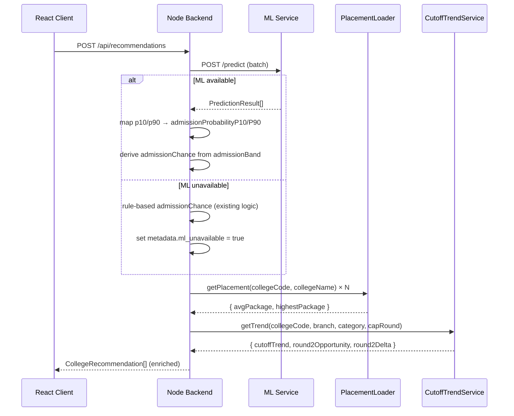

# Design Document: Enhanced Results Page

## Overview

This feature enriches the existing `/api/recommendations` response and the `ResultsPage.tsx` UI with ML-powered admission intelligence, placement package data, cutoff trend indicators, prediction explainability, and a Round 2 opportunity badge.

> **Cross-cutting note**: This feature uses the shared scoring utilities defined in `src/lib/scoring.ts` (see `college-comparison` design). `resolveAdmissionProbability()` and `generateEntryReason()` are imported from there — never redefined locally. All API response fields use camelCase. All responses include `dataVersion` in metadata.

> **UI information hierarchy**: Collapsed College_Cards show admission band + probability range only. Confidence label and top factors are shown only in the expanded card state. Never show all ML fields simultaneously on a collapsed card.

**What changes:**
- `backend-mhtcet/src/types/index.ts` — new optional fields on `CollegeRecommendation` and `ApiResponse` metadata
- `backend-mhtcet/src/services/placementLoader.ts` — new service (reads `placements.csv`, exposes `getPlacement`)
- `backend-mhtcet/src/services/cutoffTrendService.ts` — new service (computes `cutoffTrend` and `round2Opportunity`)
- `backend-mhtcet/src/controllers/recommendationController.ts` — merges placement + trend + round2 fields; passes through ML fields
- `src/services/api.ts` — extended `CollegeRecommendation` and `ApiResponse` interfaces
- `src/components/ResultsPage.tsx` — updated `CollegeCard`, `StatCard`/Stats_Bar, filter/sort logic

**What stays the same:**
- `dataService.ts` and `recommendationService.ts` core logic (filtering, scoring, `admissionChance` rule-based fallback)
- All existing API routes and their URL paths
- The `admissionChance: 'High' | 'Medium' | 'Low'` field is retained for backward compatibility

---

## Architecture



---

## Components and Interfaces

### Backend: PlacementLoader

Singleton service initialised at startup. Reads `PLACEMENT_DATA_PATH` (default `./data/placements.csv`).

```typescript
// backend-mhtcet/src/services/placementLoader.ts
export interface PlacementRecord {
  collegeCode: string;
  collegeName: string;
  avgPackage: string | null;   // formatted "₹X LPA"
  highestPackage: string | null;
}

export class PlacementLoader {
  private byCode: Map<string, PlacementRecord> = new Map();
  private byName: Map<string, PlacementRecord> = new Map(); // normalised name fallback

  async load(filePath: string): Promise<void>;
  getPlacement(collegeCode: string, collegeName: string): { avgPackage: string | null; highestPackage: string | null };
}

export const placementLoader = new PlacementLoader();
```

**Startup integration** — `server.ts` calls `await placementLoader.load(process.env.PLACEMENT_DATA_PATH ?? './data/placements.csv')` before `app.listen`.

### Backend: CutoffTrendService

Reads from the already-loaded `dataService` in-memory data. No additional file I/O.

```typescript
// backend-mhtcet/src/services/cutoffTrendService.ts
export type TrendDirection = 'rising' | 'falling' | 'stable';

export interface TrendResult {
  cutoffTrend: TrendDirection;
  round2Opportunity: boolean;
  round2Delta: number | null; // avg cap_round_delta in percentile points, null if insufficient data
}

export class CutoffTrendService {
  getTrend(
    collegeCode: string,
    branchName: string,
    category: string,
    capRound: string
  ): TrendResult;
}

export const cutoffTrendService = new CutoffTrendService();
```

**Trend computation logic:**
1. Filter `dataService.getAllColleges()` for matching `(collegeCode, branchName, category, capRound)`.
2. Sort by `year` descending. Take the most recent year cutoff (`latest`) and the cutoff from 2 years prior (`prior`).
3. If fewer than 2 distinct years exist → `cutoffTrend = 'stable'`.
4. `delta = latest - prior`. If `delta > 1.0` → `'rising'`; if `delta < -1.0` → `'falling'`; else `'stable'`.

**Round 2 computation logic:**
1. For the same `(collegeCode, branchName, category)`, find all rows where both Round I and Round II exist for the same year.
2. Compute `cap_round_delta = roundI_cutoff - roundII_cutoff` per year.
3. Average across available years. If avg ≥ 3.0 → `round2Opportunity = true`.
4. If no paired data → `round2Opportunity = false`, `round2Delta = null`.

### Backend: Updated recommendationController

```typescript
// After building recommendations array:
const enriched = recommendations.map(rec => {
  const placement = placementLoader.getPlacement(rec.code, rec.name);
  const trend = cutoffTrendService.getTrend(rec.code, rec.branch, rec.category, rec.capRound);
  const mlFields = mlResult?.find(m => m.id === rec.id); // from ML service batch call

  return {
    ...rec,
    ...placement,
    ...trend,
    // ML pass-through (when available):
    admissionBand: mlFields?.admission_band,
    admissionProbabilityP10: mlFields?.p10,
    admissionProbabilityP90: mlFields?.p90,
    confidenceLabel: mlFields?.confidence_label,
    topFactors: mlFields?.top_factors,
    // backward-compat mapping:
    admissionChance: mlFields
      ? (['Safe', 'Likely'].includes(mlFields.admission_band) ? 'High'
        : mlFields.admission_band === 'Moderate' ? 'Medium' : 'Low')
      : rec.admissionChance,
  };
});

const metadata = {
  totalResults: enriched.length,
  query: request,
  timestamp: new Date().toISOString(),
  ...(mlUnavailable ? { ml_unavailable: true } : {}),
};
```

### Frontend: Updated CollegeRecommendation interface (api.ts)

```typescript
export interface CollegeRecommendation {
  // existing fields unchanged
  id: string;
  name: string;
  code: string;
  branch: string;
  branchCode: string;
  location: string;
  district: string;
  category: string;
  cutoffPercentile: number;
  percentileDifference: number;
  collegeType: string;
  fees: string;
  seats: number;
  admissionChance: 'High' | 'Medium' | 'Low';
  capRound: string;
  year: string;
  // new optional fields
  admissionBand?: 'Safe' | 'Likely' | 'Moderate' | 'Risky';
  admissionProbabilityP10?: number;
  admissionProbabilityP90?: number;
  confidenceLabel?: string;
  topFactors?: string[];
  cutoffTrend?: 'rising' | 'falling' | 'stable';
  round2Opportunity?: boolean;
  round2Delta?: number | null;
  avgPackage?: string | null;
  highestPackage?: string | null;
}

export interface ApiResponse<T> {
  success: boolean;
  data?: T;
  message?: string;
  error?: string;
  metadata?: {
    totalResults: number;
    query: RecommendationRequest;
    timestamp: string;
    ml_unavailable?: boolean;  // new
  };
}
```

### Frontend: CollegeCard changes

The `CollegeCard` component gains a `mlUnavailable` prop (passed down from `ResultsPage`) and branches its rendering:

- **Collapsed face additions:** admission band badge (or legacy label), probability range, cutoff trend indicator, avg package chip, Round 2 badge
- **Expanded view additions:** highest package, top factors pills (up to 3), confidence label, "Basic prediction" indicator when `mlUnavailable`

Band colour config:

```typescript
const BAND_CONFIG = {
  Safe:     { gradient: 'from-emerald-500/20 to-green-500/20',  border: 'border-emerald-400/30', text: 'text-emerald-300', accent: 'from-emerald-400 to-green-400' },
  Likely:   { gradient: 'from-blue-500/20 to-cyan-500/20',      border: 'border-blue-400/30',    text: 'text-blue-300',    accent: 'from-blue-400 to-cyan-400' },
  Moderate: { gradient: 'from-amber-500/20 to-orange-500/20',   border: 'border-amber-400/30',   text: 'text-amber-300',   accent: 'from-amber-400 to-orange-400' },
  Risky:    { gradient: 'from-red-500/20 to-rose-500/20',       border: 'border-red-400/30',     text: 'text-red-300',     accent: 'from-red-400 to-rose-400' },
};

const TREND_CONFIG = {
  rising:  { symbol: '↑', color: 'text-red-400',     title: 'Cutoff rising' },
  falling: { symbol: '↓', color: 'text-emerald-400', title: 'Cutoff falling' },
  stable:  { symbol: '→', color: 'text-slate-400',   title: 'Cutoff stable' },
};
```

### Frontend: Stats_Bar changes

```typescript
// ML mode (ml_unavailable absent/false)
const mlStats = {
  safe:     colleges.filter(c => c.admissionBand === 'Safe').length,
  likely:   colleges.filter(c => c.admissionBand === 'Likely').length,
  moderate: colleges.filter(c => c.admissionBand === 'Moderate').length,
  risky:    colleges.filter(c => c.admissionBand === 'Risky').length,
};

// Fallback mode (ml_unavailable: true)
const legacyStats = {
  high:   colleges.filter(c => c.admissionChance === 'High').length,
  medium: colleges.filter(c => c.admissionChance === 'Medium').length,
  low:    colleges.filter(c => c.admissionChance === 'Low').length,
};
```

### Frontend: Filter/Sort changes

```typescript
type FilterBand = 'all' | 'Safe' | 'Likely' | 'Moderate' | 'Risky';
type FilterChanceLegacy = 'all' | 'High' | 'Medium' | 'Low';

// Sort by chance (ML mode):
const BAND_ORDER: Record<string, number> = { Safe: 0, Likely: 1, Moderate: 2, Risky: 3 };
// Secondary sort: admission_probability descending (ties within same band)

// Sort by chance (fallback mode):
const CHANCE_ORDER: Record<string, number> = { High: 0, Medium: 1, Low: 2 };
```

---

## Data Models

### Backend `CollegeRecommendation` (types/index.ts)

```typescript
export interface CollegeRecommendation {
  // existing fields
  id: string;
  name: string;
  code: string;
  branch: string;
  branchCode: string;
  location: string;
  district: string;
  category: string;
  cutoffPercentile: number;
  percentileDifference: number;
  collegeType: string;
  fees: string;
  seats: number;
  admissionChance: 'High' | 'Medium' | 'Low';
  capRound: string;
  year: string;
  // new optional fields
  admissionBand?: 'Safe' | 'Likely' | 'Moderate' | 'Risky';
  admissionProbabilityP10?: number;
  admissionProbabilityP90?: number;
  confidenceLabel?: string;
  topFactors?: string[];
  cutoffTrend?: 'rising' | 'falling' | 'stable';
  round2Opportunity?: boolean;
  round2Delta?: number | null;
  avgPackage?: string | null;
  highestPackage?: string | null;
}
```

### Backend `ApiResponse` metadata (types/index.ts)

```typescript
metadata?: {
  totalResults: number;
  query?: unknown;
  timestamp: string;
  ml_unavailable?: boolean;
};
```

### Placement CSV schema

| Column           | Type   | Notes                                      |
|------------------|--------|--------------------------------------------|
| `college_code`   | string | Primary lookup key; may be empty           |
| `college_name`   | string | Fallback lookup key (normalised)           |
| `avg_package`    | number | Plain number (e.g. `6.5`) or pre-formatted |
| `highest_package`| number | Plain number or pre-formatted              |

---

## Correctness Properties

*A property is a characteristic or behavior that should hold true across all valid executions of a system — essentially, a formal statement about what the system should do. Properties serve as the bridge between human-readable specifications and machine-verifiable correctness guarantees.*

### Property 1: ML band display replaces legacy label

*For any* `CollegeRecommendation` where `admissionBand` is present, the rendered `CollegeCard` should display exactly the band label ("Safe", "Likely", "Moderate", or "Risky") and should not simultaneously display the legacy "High", "Medium", or "Low" label.

**Validates: Requirements 1.1, 1.5**

### Property 2: Probability range formatting

*For any* pair of integers `p10` and `p90` (0–100), the probability range string rendered by `CollegeCard` should equal `"{p10}–{p90}% chance"`.

**Validates: Requirements 1.2**

### Property 3: Admission band colour mapping

*For any* `admissionBand` value, the CSS classes applied to the `CollegeCard` badge should correspond to the defined palette: emerald for "Safe", blue for "Likely", amber for "Moderate", red for "Risky".

**Validates: Requirements 1.3**

### Property 4: Fallback display when ML unavailable

*For any* `CollegeRecommendation` rendered when `ml_unavailable: true` is in the API metadata, the `CollegeCard` should display the legacy `admissionChance` label, show no probability range, show no `admissionBand` label, and show a "Basic prediction" indicator.

**Validates: Requirements 1.4, 12.2**

### Property 5: Cutoff trend indicator display and colour

*For any* `CollegeRecommendation` with a `cutoffTrend` field, the rendered `CollegeCard` should display "↑" with a red colour class for "rising", "↓" with an emerald colour class for "falling", and "→" with a grey/slate colour class for "stable".

**Validates: Requirements 2.1, 2.4**

### Property 6: Trend computation threshold

*For any* `(collegeCode, branchName, category, capRound)` combination with at least 2 years of data, `CutoffTrendService.getTrend` should return "rising" when `latestCutoff - priorCutoff > 1.0`, "falling" when `< -1.0`, and "stable" when within `±1.0`. When fewer than 2 years of data exist, it should always return "stable".

**Validates: Requirements 2.2, 2.3**

### Property 7: Placement CSV round-trip join correctness

*For any* set of placement CSV rows loaded by `PlacementLoader`, calling `getPlacement(collegeCode, collegeName)` should return the matching `avgPackage` and `highestPackage` for rows with a `college_code`, and should fall back to normalised `college_name` matching when `college_code` is absent. When no row matches either key, both fields should be `null`.

**Validates: Requirements 3.1, 3.2, 3.3, 3.4, 10.1**

### Property 8: Package value formatting

*For any* raw numeric package value `v` in the CSV (e.g. `6.5`), `PlacementLoader` should format it as `"₹6.5 LPA"`. For any value that already contains a currency symbol or unit, it should be used as-is after trimming whitespace.

**Validates: Requirements 10.6**

### Property 9: Placement fields shown on card

*For any* `CollegeRecommendation` where `avgPackage` is non-null, the collapsed `CollegeCard` should render the avg package value. Where `highestPackage` is non-null, the expanded view should render it. Where both are null, no placement section should be rendered.

**Validates: Requirements 3.5, 3.6, 3.7**

### Property 10: ML detail fields visible only in expanded state

*For any* `CollegeRecommendation` with non-empty `topFactors` and/or a `confidenceLabel`, those fields should not be present in the collapsed card DOM, and should be present (up to 3 factors) in the expanded card DOM.

**Validates: Requirements 4.1, 4.2, 4.3, 4.4, 5.1, 5.4**

### Property 11: Confidence label styling

*For any* `confidenceLabel` value, the rendered element should carry the correct colour class: emerald for "High confidence", amber for "Medium confidence", grey/slate for "Low confidence (estimated)".

**Validates: Requirements 5.2**

### Property 12: Round 2 badge on collapsed card face

*For any* `CollegeRecommendation` where `round2Opportunity: true`, the collapsed `CollegeCard` should render a "Round 2 opportunity" badge with a teal/cyan accent class.

**Validates: Requirements 6.1, 6.4, 6.5**

### Property 13: Round 2 threshold computation

*For any* `(collegeCode, branchName, category)` combination, `CutoffTrendService.getTrend` should set `round2Opportunity: true` when the average `cap_round_delta` (Round I cutoff − Round II cutoff) across available years is ≥ 3.0, and `false` otherwise (including when no paired data exists).

**Validates: Requirements 6.2, 6.3**

### Property 14: Stats bar band counts correctness

*For any* list of `CollegeRecommendation` objects with ML fields, the Stats_Bar count for each band ("Safe", "Likely", "Moderate", "Risky") should equal the number of colleges in the list where `admissionBand` equals that band value. When the list is empty, all counts should be zero.

**Validates: Requirements 7.1, 7.4, 7.5**

### Property 15: Stats bar fallback to legacy counts

*For any* list of `CollegeRecommendation` objects rendered with `ml_unavailable: true`, the Stats_Bar should display three cards ("High Chance", "Medium Chance", "Low Chance") with counts matching the number of colleges per `admissionChance` value.

**Validates: Requirements 7.2, 12.5**

### Property 16: Filter options are band-aware

*For any* `ResultsPage` rendered with ML data present, the filter control should offer "All", "Safe", "Likely", "Moderate", "Risky" options. When rendered with `ml_unavailable: true`, it should offer "All", "High", "Medium", "Low".

**Validates: Requirements 8.1, 8.2**

### Property 17: Sort order with ML bands and secondary key

*For any* list of `CollegeRecommendation` objects sorted by "Admission Chance" in ML mode, the result should be ordered Safe → Likely → Moderate → Risky, with ties within the same band broken by `admissionProbabilityP10` descending (using `admissionProbabilityP10` as a proxy for `admission_probability`).

**Validates: Requirements 8.3, 8.4**

### Property 18: admissionChance backward-compatibility mapping

*For any* `CollegeRecommendation` where `admissionBand` is present, the `admissionChance` field should equal "High" when `admissionBand` is "Safe" or "Likely", "Medium" when "Moderate", and "Low" when "Risky".

**Validates: Requirements 11.3**

### Property 19: Raw ML fields not exposed in response

*For any* enriched `CollegeRecommendation` object in the API response, the object should not contain the raw ML service fields `p10`, `p50`, or `p90` (cutoff percentile bounds) as top-level keys.

**Validates: Requirements 11.4**

### Property 20: Invalid CSV rows are skipped

*For any* placement CSV containing rows with non-numeric `avg_package` or `highest_package` values, `PlacementLoader` should skip those rows and the resulting lookup map should not contain entries for them.

**Validates: Requirements 10.3**

### Property 21: Non-ML fields shown in fallback mode

*For any* `CollegeRecommendation` rendered with `ml_unavailable: true`, if `cutoffTrend`, `round2Opportunity`, `avgPackage`, or `highestPackage` are present in the data, they should still be rendered on the card.

**Validates: Requirements 12.3**

---

## Error Handling

| Scenario | Behaviour |
|---|---|
| `placements.csv` not found | `PlacementLoader` logs a warning, initialises with empty map; server starts normally |
| CSV row with non-numeric package | Row skipped, warning logged with row index and value |
| ML service timeout / 5xx | Controller catches error, sets `ml_unavailable: true` in metadata, falls back to rule-based `admissionChance` |
| ML service returns partial results (some colleges missing) | Missing colleges get no ML fields; `admissionChance` computed by rule-based fallback for those entries |
| `CutoffTrendService` finds no data for a combination | Returns `{ cutoffTrend: 'stable', round2Opportunity: false, round2Delta: null }` |
| Frontend receives response with no ML fields | `ResultsPage` detects absence of `admissionBand` on first college (or `ml_unavailable` flag) and renders legacy mode |

---

## Testing Strategy

### Unit Tests

**PlacementLoader** (`placementLoader.test.ts`):
- Load a valid CSV and verify `getPlacement` returns correct formatted values (Property 7, 8)
- Load a CSV with missing `college_code` rows and verify name-based fallback (Property 7)
- Load a CSV with non-numeric package values and verify those rows are skipped (Property 20)
- Load from a non-existent path and verify no exception is thrown and map is empty (edge case from Req 10.2)

**CutoffTrendService** (`cutoffTrendService.test.ts`):
- Provide 3 years of data with delta > 1.0 → expect "rising" (Property 6)
- Provide 3 years of data with delta < -1.0 → expect "falling" (Property 6)
- Provide 3 years of data with delta within ±1.0 → expect "stable" (Property 6)
- Provide only 1 year of data → expect "stable" (Property 6 edge case)
- Provide paired Round I/II data with avg delta ≥ 3.0 → expect `round2Opportunity: true` (Property 13)
- Provide paired Round I/II data with avg delta < 3.0 → expect `round2Opportunity: false` (Property 13)

**admissionChance mapping** (`recommendationController.test.ts`):
- For each `admissionBand` value, verify the derived `admissionChance` follows the mapping (Property 18)
- Verify raw `p10`/`p50`/`p90` fields are absent from the response object (Property 19)

### Component Tests

**CollegeCard** (`CollegeCard.test.tsx`):
- Render with `admissionBand: 'Safe'` → verify band label shown, legacy label absent, emerald classes applied (Properties 1, 3)
- Render with `p10: 78, p90: 85` → verify "78–85% chance" string present (Property 2)
- Render with `ml_unavailable: true` → verify legacy label shown, "Basic prediction" indicator present, no probability range (Property 4)
- Render with `cutoffTrend: 'rising'` → verify "↑" with red class; `'falling'` → "↓" emerald; `'stable'` → "→" grey (Property 5)
- Render with `avgPackage: '₹6.5 LPA'` → verify visible in collapsed state (Property 9)
- Render with `highestPackage` set, card expanded → verify visible; card collapsed → verify absent (Property 9)
- Render with `topFactors: ['A', 'B', 'C', 'D']` → verify only 3 shown in expanded state, none in collapsed (Property 10)
- Render with `confidenceLabel: 'High confidence'` → verify emerald class; `'Low confidence (estimated)'` → grey/slate class (Property 11)
- Render with `round2Opportunity: true` → verify badge present in collapsed state with teal class (Property 12)
- Render with `ml_unavailable: true` and `cutoffTrend` set → verify trend still rendered (Property 21)

**ResultsPage / Stats_Bar** (`ResultsPage.test.tsx`):
- Render with ML colleges → verify four stat cards with correct counts (Property 14)
- Render with `ml_unavailable: true` → verify three legacy stat cards (Property 15)
- Render with ML data → verify filter options include band names (Property 16)
- Sort by "Admission Chance" with ML data → verify Safe-first ordering with probability tiebreak (Property 17)

### Property-Based Tests

Use **fast-check** (TypeScript) for all property tests. Each test runs a minimum of 100 iterations.

```typescript
// Feature: enhanced-results-page, Property 2: Probability range formatting
fc.assert(fc.property(
  fc.integer({ min: 0, max: 100 }),
  fc.integer({ min: 0, max: 100 }),
  (p10, p90) => {
    const result = formatProbabilityRange(p10, p90);
    return result === `${p10}–${p90}% chance`;
  }
), { numRuns: 100 });

// Feature: enhanced-results-page, Property 6: Trend computation threshold
fc.assert(fc.property(
  fc.array(fc.record({ year: fc.string(), cutoffPercentile: fc.float({ min: 0, max: 100 }) }), { minLength: 2 }),
  (dataPoints) => {
    const trend = computeTrend(dataPoints);
    const delta = latestCutoff(dataPoints) - priorCutoff(dataPoints);
    if (delta > 1.0) return trend === 'rising';
    if (delta < -1.0) return trend === 'falling';
    return trend === 'stable';
  }
), { numRuns: 200 });

// Feature: enhanced-results-page, Property 7: Placement CSV round-trip join
fc.assert(fc.property(
  fc.array(fc.record({ collegeCode: fc.string(), collegeName: fc.string(), avgPackage: fc.float({ min: 1, max: 50 }), highestPackage: fc.float({ min: 1, max: 100 }) })),
  async (rows) => {
    const loader = new PlacementLoader();
    await loader.loadFromRows(rows);
    for (const row of rows) {
      const result = loader.getPlacement(row.collegeCode, row.collegeName);
      if (result.avgPackage === null) return false;
    }
    return true;
  }
), { numRuns: 100 });

// Feature: enhanced-results-page, Property 13: Round 2 threshold computation
fc.assert(fc.property(
  fc.array(fc.record({ roundI: fc.float({ min: 50, max: 99 }), roundII: fc.float({ min: 50, max: 99 }) }), { minLength: 1 }),
  (pairs) => {
    const avgDelta = pairs.reduce((s, p) => s + (p.roundI - p.roundII), 0) / pairs.length;
    const result = computeRound2Opportunity(pairs);
    return result === (avgDelta >= 3.0);
  }
), { numRuns: 200 });

// Feature: enhanced-results-page, Property 17: Sort order with ML bands
fc.assert(fc.property(
  fc.array(arbitraryCollegeWithBand()),
  (colleges) => {
    const sorted = sortByAdmissionChance(colleges);
    return isBandOrdered(sorted); // Safe ≤ Likely ≤ Moderate ≤ Risky by index
  }
), { numRuns: 100 });
```
