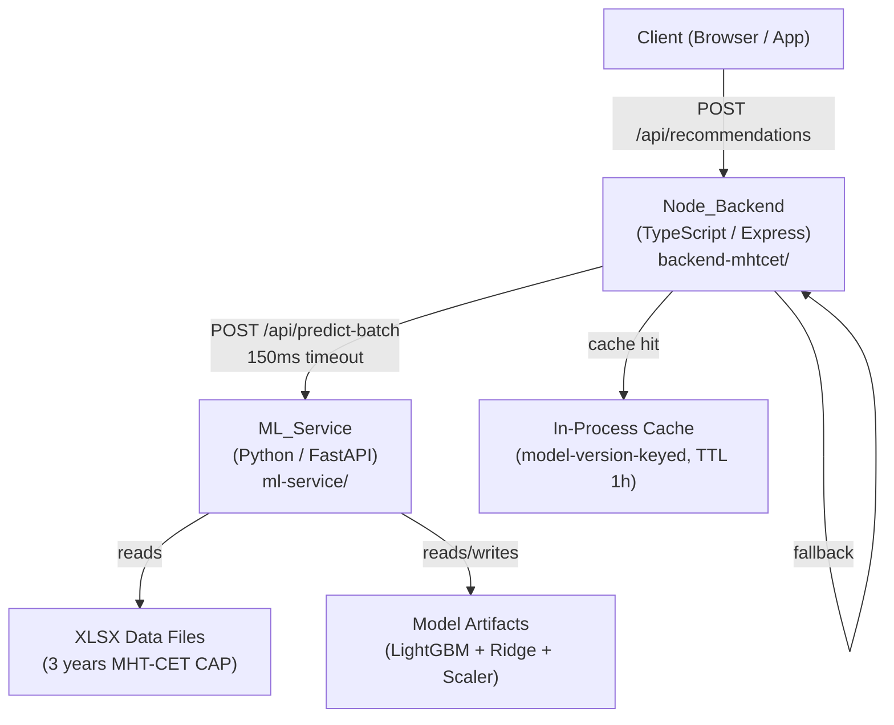
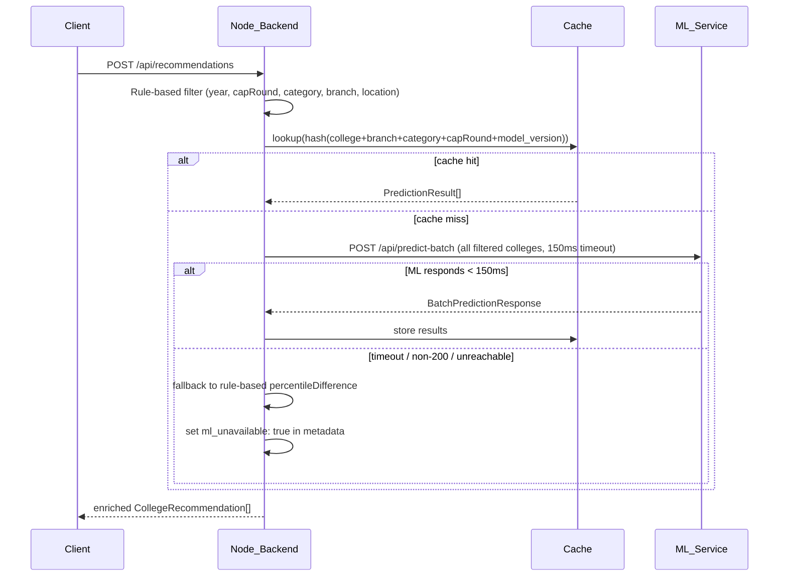
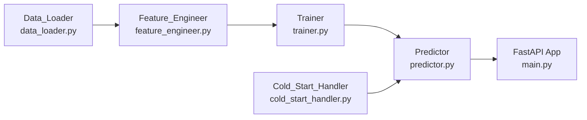
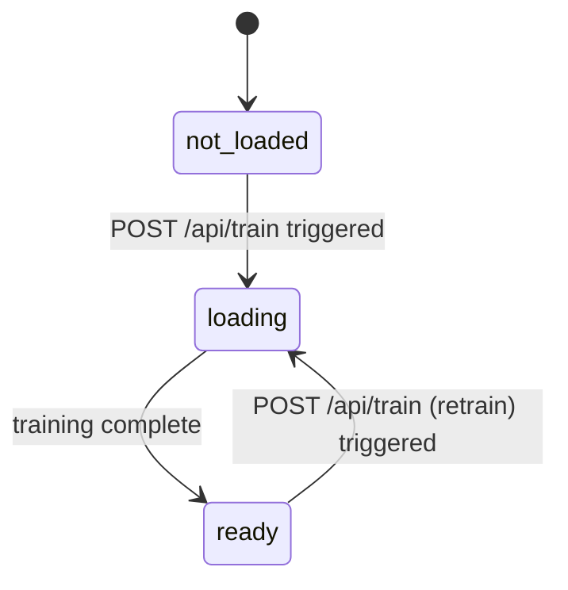
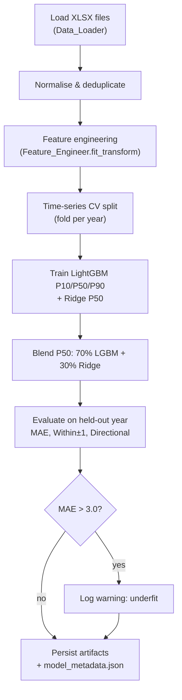
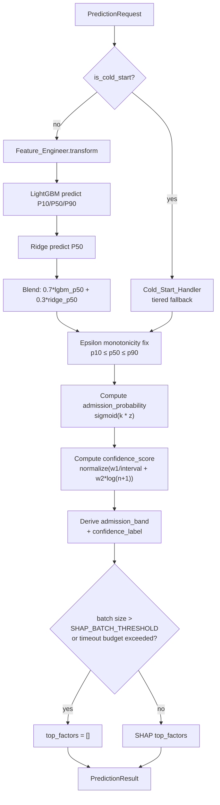
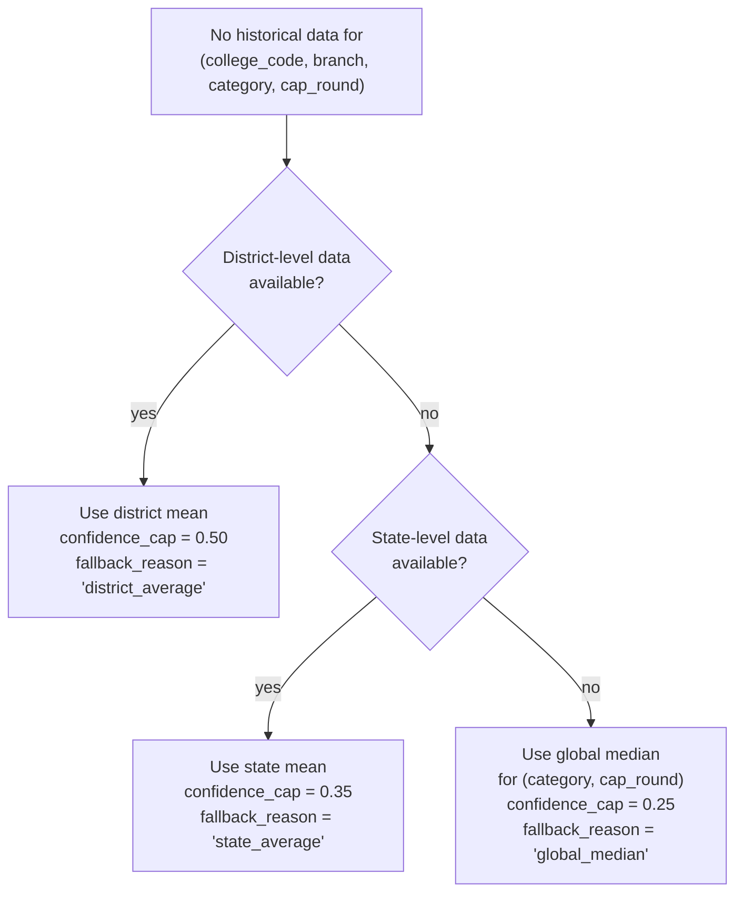

# Design Document: MHT-CET Cutoff Prediction

## Overview

This feature replaces the rule-based `admissionChance` classifier in the Node.js backend with an ML-powered cutoff prediction system. A Python FastAPI microservice (`ML_Service`) trains a LightGBM quantile regression ensemble on 3 years of MHT-CET CAP data and serves predictions over HTTP. The existing Node.js backend (`Node_Backend`) calls the ML_Service in batch, enriches recommendation results with predicted cutoff bounds and admission probability, and falls back gracefully to the existing rule-based logic when the ML_Service is unavailable.

The system is designed for extensibility: the `exam_type` feature allows JEE, NEET, or SSC data to be added later without rewriting the core pipeline.

---

## Architecture

### System Overview



### Request Flow



### Deployment Topology

Both services run as separate processes (or containers). The ML_Service is an internal service — it is not exposed to the public internet. The Node_Backend is the only caller.

```
[Node_Backend :3000] --HTTP--> [ML_Service :8000]
```

---

## Components and Interfaces

### ML_Service Internal Modules



#### Data_Loader (`data_loader.py`)

Reads all XLSX files from the configured data directory, normalises column names to the canonical schema, discards invalid rows, deduplicates, and returns a `pandas.DataFrame`.

```python
class DataLoader:
    def load(self, data_dir: str, exam_type: str = "mhtcet") -> pd.DataFrame: ...
```

#### Feature_Engineer (`feature_engineer.py`)

Accepts the normalised DataFrame and produces a feature matrix with all 11 engineered features. Stateless at inference time — all group statistics are computed during training and persisted as part of the feature scaler artifact.

```python
class FeatureEngineer:
    def fit_transform(self, df: pd.DataFrame) -> pd.DataFrame: ...
    def transform(self, df: pd.DataFrame) -> pd.DataFrame: ...  # inference-time
```

#### Trainer (`trainer.py`)

Orchestrates time-series CV, trains LightGBM (3 quantile models) and Ridge, blends, evaluates, and persists artifacts.

```python
class Trainer:
    def train(self, df: pd.DataFrame, model_dir: str) -> TrainingResult: ...
```

#### Predictor (`predictor.py`)

Loads model artifacts from disk, applies the feature pipeline, runs inference, applies the epsilon monotonicity fix, computes `admission_probability`, `confidence_score`, `admission_band`, `confidence_label`, and `top_factors` via SHAP.

```python
class Predictor:
    def load_artifacts(self, model_dir: str) -> None: ...
    def predict(self, request: PredictionRequest) -> PredictionResult: ...
    def predict_batch(self, requests: list[PredictionRequest]) -> list[PredictionResult]: ...
```

#### Cold_Start_Handler (`cold_start_handler.py`)

Provides tiered fallback predictions for unseen combinations. Populated from training data statistics at startup.

```python
class ColdStartHandler:
    def get_fallback(
        self,
        branch_name: str,
        category: str,
        cap_round: str,
        district: str,
        college_code: str,
    ) -> tuple[float, float, str]: ...  # (p50_estimate, confidence_cap, fallback_reason)
```

> `district` is passed directly from `PredictionRequest.district` — no internal lookup is performed.

#### Model Load State Machine

The ML_Service tracks model state as one of three values: `"not_loaded"`, `"loading"`, `"ready"`.



State-dependent behaviour:
- While `"loading"`: `POST /api/predict` and `POST /api/predict-batch` return HTTP 503 `{"detail": "Model is currently being retrained. Please retry shortly."}`
- While `"loading"`: `POST /api/train` returns HTTP 409 `{"detail": "Training job already in progress."}`
- `GET /health` always returns the current `model_state` field regardless of state.

### Node_Backend Changes

#### MLServiceClient (`mlServiceClient.ts`)

New service class wrapping `axios` with a 150ms timeout. Handles batch calls and error cases.

```typescript
class MLServiceClient {
  async predictBatch(requests: MLPredictionRequest[]): Promise<MLPredictionResult[]>
}
```

#### Updated `recommendationService.ts`

After rule-based filtering, calls `MLServiceClient.predictBatch`. On success, merges ML results into `CollegeRecommendation`. On failure, falls back to existing `percentileDifference` logic and sets `ml_unavailable: true`.

#### Cache (`mlPredictionCache.ts`)

Simple in-process `Map<string, { result: MLPredictionResult; expiresAt: number }>`. Cache key: `SHA256(college_code + branch_name + category + cap_round + model_version)`. TTL: configurable, default 3600s.

---

## Data Models

### ML_Service (Python / Pydantic)

```python
class PredictionRequest(BaseModel):
    college_code: str
    branch_name: str
    category: str
    cap_round: Literal["I", "II", "III"]
    student_percentile: float = Field(..., ge=0, le=100)
    exam_type: str = "mhtcet"
    district: str = ""                    # passed directly from request; used by Cold_Start_Handler

class PredictionResult(BaseModel):
    p10: float
    p50: float
    p90: float
    admission_probability: float          # 0–100
    confidence_score: float               # 0–1
    confidence_label: str                 # "High confidence" | "Medium confidence" | "Low confidence (estimated)"
    admission_band: str                   # "Safe" | "Likely" | "Moderate" | "Risky"
    top_factors: list[str]                # up to 3 human-readable strings
    predicted_year: int
    fallback_reason: str | None = None    # set when Cold_Start_Handler is used

class BatchPredictionRequest(BaseModel):
    requests: list[PredictionRequest]

class BatchPredictionResponse(BaseModel):
    results: list[PredictionResult]

class HealthResponse(BaseModel):
    status: str                           # "ok" | "degraded"
    model_loaded: bool
    model_version: str | None
    training_date: str | None
    validation_mae: float | None
    model_state: str                      # "not_loaded" | "loading" | "ready"

class MetricsResponse(BaseModel):
    p95_latency_ms: float
    total_predictions: int
    fallback_pct_district: float
    fallback_pct_state: float
    fallback_pct_global: float
    cold_start_frequency: float
    model_version: str
```

### Node_Backend (TypeScript)

```typescript
// New fields added to CollegeRecommendation
interface CollegeRecommendation {
  // ... existing fields ...
  admissionChance: 'High' | 'Medium' | 'Low';   // kept for fallback compatibility
  // ML-enriched fields (present when ML_Service is available)
  p10?: number;
  p50?: number;
  p90?: number;
  admissionProbability?: number;
  admissionBand?: 'Safe' | 'Likely' | 'Moderate' | 'Risky';
  confidenceLabel?: string;
  topFactors?: string[];
}

// New metadata field on ApiResponse
interface ApiResponse<T> {
  // ... existing fields ...
  metadata?: {
    totalResults: number;
    query?: unknown;
    timestamp: string;
    ml_unavailable?: boolean;             // set when ML_Service fallback is triggered
  };
}

interface MLPredictionRequest {
  college_code: string;
  branch_name: string;
  category: string;
  cap_round: 'I' | 'II' | 'III';
  student_percentile: number;
  exam_type?: string;
  district?: string;                      // optional; passed through from the incoming recommendation request
}

interface MLPredictionResult {
  p10: number;
  p50: number;
  p90: number;
  admission_probability: number;
  confidence_score: number;
  confidence_label: string;
  admission_band: string;
  top_factors: string[];
  predicted_year: number;
  fallback_reason?: string;
}
```

### Model Artifacts on Disk

```
ml-service/models/
├── lgbm_p10.txt              # LightGBM quantile 0.10 model
├── lgbm_p50.txt              # LightGBM quantile 0.50 model
├── lgbm_p90.txt              # LightGBM quantile 0.90 model
├── ridge_p50.pkl             # Ridge regression model (joblib)
├── feature_scaler.pkl        # StandardScaler + group statistics (joblib)
├── feature_columns.json      # ordered list of feature column names
└── model_metadata.json       # training metadata
```

`model_metadata.json` schema:
```json
{
  "model_version": "20240115_143022",
  "training_date": "2024-01-15T14:30:22Z",
  "data_row_count": 12450,
  "validation_mae": 1.23,
  "validation_within_1_accuracy": 0.74,
  "validation_directional_accuracy": 0.68,
  "exam_types": ["mhtcet"]
}
```

---

## Feature Engineering Pipeline

All 11 features are computed by `Feature_Engineer`. Group statistics (means, medians, std devs) are computed on training data and stored in `feature_scaler.pkl` for use at inference time.

| # | Feature | Description | Fallback |
|---|---------|-------------|----------|
| 1 | `cutoff_t1` | Cutoff for same (college, branch, category, cap_round) in year-1 | Group mean |
| 2 | `cutoff_t2` | Cutoff in year-2 | Group mean |
| 3 | `cutoff_t3` | Cutoff in year-3 | Group mean |
| 4 | `cutoff_volatility` | Rolling std dev of cutoff over available years | 0.0 |
| 5 | `cap_round_delta` | Cutoff(Round I) − Cutoff(Round II) for same (college, branch, category, year) | 0.0 |
| 6 | `college_prestige_score` | Mean cutoff across all branches/categories for college in most recent year | Global mean |
| 7 | `branch_demand_index` | Mean cutoff across all colleges/categories for branch in most recent year | Global mean |
| 8 | `category_fill_rate` | Filled seats / intake; when intake unavailable → median fill rate for category | Category median |
| 9 | `seat_count` | Intake (numeric) | Branch median |
| 10 | `location_influence` | Mean cutoff of colleges in same location/district | Global mean |
| 11 | `global_cutoff_shift` | Mean cutoff (current year) − mean cutoff (previous year) | 0.0 |

Additional flags (not model features, used for routing):
- `is_cold_start` (bool): True when any lag feature was imputed
- `exam_type` (categorical, label-encoded): `"mhtcet"` = 0

---

## Model Architecture

### LightGBM Quantile Regression

Three separate LightGBM models are trained, one per quantile:

| Model | Quantile | Output |
|-------|----------|--------|
| `lgbm_p10` | 0.10 | Lower bound (P10) |
| `lgbm_p50` | 0.50 | Median cutoff |
| `lgbm_p90` | 0.90 | Upper bound (P90) |

Objective: `quantile`, `alpha` set per model. Key hyperparameters (tunable):
- `n_estimators`: 500
- `learning_rate`: 0.05
- `num_leaves`: 31
- `min_child_samples`: 20 (prevents overfitting on small groups)

### Ridge Regression Blend

A Ridge model is trained on the same feature set targeting P50. The final P50 estimate is:

```
p50_final = 0.70 * lgbm_p50 + 0.30 * ridge_p50
```

P10 and P90 are taken directly from LightGBM (no Ridge blend for bounds).

### SHAP for top_factors

`shap.TreeExplainer` is used on `lgbm_p50` at inference time. The top 3 features by absolute SHAP value are mapped to human-readable strings via a lookup table:

```python
SHAP_LABEL_MAP = {
    "cutoff_t1": "Recent cutoff trend",
    "branch_demand_index": "High branch demand",
    "college_prestige_score": "College prestige",
    "category_fill_rate": "Low seat availability",
    "cutoff_volatility": "Volatile cutoff history",
    "cap_round_delta": "Round-to-round cutoff shift",
    "global_cutoff_shift": "Macro cutoff trend",
    "seat_count": "Seat count",
    "location_influence": "Location demand",
    ...
}
```

**SHAP performance safeguard**: SHAP computation is skipped for batch requests with more than `SHAP_BATCH_THRESHOLD` items (default: `20`). For items beyond this threshold in a batch, `top_factors` is set to `[]`. For single predictions (`POST /api/predict`), SHAP is always computed. Pre-computing SHAP for top college-branch combinations at startup (feature importance caching) is a future optimisation.

---

## Training Pipeline



### Time-Series CV

For a dataset with years [Y1, Y2, Y3]:
- Fold 1: train on Y1, validate on Y2
- Fold 2: train on Y1+Y2, validate on Y3 (final fold)

No shuffling. No future data leaks into training folds.

### Artifact Persistence

Triggered by `POST /api/train`. The job runs in a background thread (FastAPI `BackgroundTasks`). Artifacts are written atomically: written to a temp directory first, then renamed to the model directory on success. `model_version` is a timestamp string (`YYYYMMDD_HHMMSS`).

---

## Inference Pipeline



**SHAP safeguard**: For batch requests with more than `SHAP_BATCH_THRESHOLD` (default: `20`) items, SHAP is skipped and `top_factors = []`. For single predictions, SHAP is always computed.

**ML_Service internal timeout guard**: The ML_Service maintains a soft timeout budget per batch request of `ML_BATCH_TIMEOUT_MS` (default: `120ms`), leaving headroom under the Node_Backend's 150ms hard timeout. If processing a batch exceeds this budget, remaining items are processed without SHAP (`top_factors = []`) to stay within the time budget.

### Admission Probability

```
z = (student_percentile - p50) / max(p90 - p10, epsilon)
admission_probability = sigmoid(k * z) * 100
```

where `k ∈ [2, 3]` (default 2.5), `sigmoid(x) = 1 / (1 + exp(-x))`.

### Confidence Score

```
raw = w1 * (1 / max(p90 - p10, epsilon)) + w2 * log(sample_size + 1)
confidence_score = clip((raw - raw_min) / (raw_max - raw_min), 0, 1)
```

`raw_min` and `raw_max` are computed on training data and stored in `feature_scaler.pkl`. Default weights: `w1 = 0.6`, `w2 = 0.4`.

**`sample_size` definition**: the number of historical records for the `(college_code, branch_name, category)` group in the training data. This count is computed during `Feature_Engineer.fit_transform` and stored in `feature_scaler.pkl` as a lookup dictionary keyed by `(college_code, branch_name, category)`. At inference time, if the key is not found in the lookup (new college or branch), `sample_size` defaults to `1`.

### Epsilon Monotonicity Fix

```python
if p10 > p50:
    p10 = p50 - epsilon
if p90 < p50:
    p90 = p50 + epsilon
```

`epsilon` is configurable, default `0.2`.

### Admission Band and Confidence Label

| `admission_probability` | `admission_band` |
|------------------------|-----------------|
| ≥ 80% | "Safe" |
| 50–79% | "Likely" |
| 20–49% | "Moderate" |
| < 20% | "Risky" |

| `confidence_score` | `confidence_label` |
|-------------------|-------------------|
| > 0.75 | "High confidence" |
| 0.50–0.75 | "Medium confidence" |
| < 0.50 | "Low confidence (estimated)" |

---

## Cold Start Handler



The Cold_Start_Handler is populated at startup from training data statistics. It never returns null for any valid `(branch_name, category, cap_round)` combination present in training data.

---

## API Design

### POST /api/predict

```
Request:
{
  "college_code": "1234",
  "branch_name": "computer engineering",
  "category": "OPEN",
  "cap_round": "II",
  "student_percentile": 87.5,
  "exam_type": "mhtcet",          // optional, default "mhtcet"
  "district": "Pune"              // optional, default ""; used by Cold_Start_Handler for tiered fallback
}

Response 200:
{
  "p10": 84.2,
  "p50": 86.8,
  "p90": 89.1,
  "admission_probability": 72.4,
  "confidence_score": 0.81,
  "confidence_label": "High confidence",
  "admission_band": "Likely",
  "top_factors": ["Recent cutoff trend", "High branch demand", "College prestige"],
  "predicted_year": 2025,
  "fallback_reason": null
}

Response 422: { "detail": [{ "loc": ["body", "student_percentile"], "msg": "...", "type": "..." }] }
Response 503: { "detail": "Model artifacts not loaded. Trigger POST /api/train first." }
```

### POST /api/predict-batch

```
Request:  { "requests": [ <PredictionRequest>, ... ] }   // each item may include "district" field
Response: { "results": [ <PredictionResult>, ... ] }   // same order as input
```

> `district` is passed through per-item from the Node_Backend's recommendation context. The Cold_Start_Handler reads it directly from the request — no internal lookup is performed.

### POST /api/train

```
Response 202: { "job_id": "train_20240115_143022", "status": "accepted" }
```

### GET /health

```
Response 200 (loaded):
{
  "status": "ok",
  "model_loaded": true,
  "model_version": "20240115_143022",
  "training_date": "2024-01-15T14:30:22Z",
  "validation_mae": 1.23,
  "model_state": "ready"
}

Response 503 (not loaded):
{ "status": "degraded", "model_loaded": false, "model_state": "not_loaded", ... }

Response 200 (training in progress):
{ "status": "degraded", "model_loaded": false, "model_state": "loading", ... }
```

### GET /metrics

```
Response 200:
{
  "p95_latency_ms": 42.1,
  "total_predictions": 18420,
  "fallback_pct_district": 3.2,
  "fallback_pct_state": 0.8,
  "fallback_pct_global": 0.1,
  "cold_start_frequency": 4.1,
  "model_version": "20240115_143022"
}
```

---

## Node.js Integration Changes

### New Files

```
backend-mhtcet/src/
├── services/
│   ├── mlServiceClient.ts       # axios wrapper, 150ms timeout
│   └── mlPredictionCache.ts     # in-process Map cache, model-version-keyed
```

### Modified Files

- `recommendationService.ts`: after rule-based filter, calls `mlServiceClient.predictBatch`, merges results, falls back on error
- `types/index.ts`: add ML fields to `CollegeRecommendation`, add `ml_unavailable` to `ApiResponse.metadata`

### MLServiceClient

```typescript
import axios from 'axios';
import { randomUUID } from 'crypto';

const ML_SERVICE_URL = process.env.ML_SERVICE_URL ?? 'http://localhost:8000';
const ML_TIMEOUT_MS = 150;

class MLServiceClient {
  async predictBatch(requests: MLPredictionRequest[], requestId?: string): Promise<MLPredictionResult[]> {
    const response = await axios.post(
      `${ML_SERVICE_URL}/api/predict-batch`,
      { requests },
      {
        timeout: ML_TIMEOUT_MS,
        headers: { 'X-Request-ID': requestId ?? randomUUID() },
      }
    );
    return response.data.results;
  }
}
export const mlServiceClient = new MLServiceClient();
```

### Cache Key

```typescript
import { createHash } from 'crypto';

function cacheKey(req: MLPredictionRequest, modelVersion: string): string {
  return createHash('sha256')
    .update(`${req.college_code}|${req.branch_name}|${req.category}|${req.cap_round}|${modelVersion}`)
    .digest('hex');
}
```

### Cache Warming on Startup

On Node_Backend startup, after confirming the ML_Service is healthy, the backend pre-fetches predictions for the top `ML_CACHE_WARM_TOP_N` (default: `100`) most-queried `(college_code, branch_name, category, cap_round)` combinations by historical query frequency (or all combinations if fewer than 100 exist). This is implemented as a `warmCache()` function in `mlPredictionCache.ts` called during server startup. If the ML_Service is unavailable at startup, cache warming is skipped silently (non-blocking).

```typescript
// mlPredictionCache.ts
export async function warmCache(topN: number = ML_CACHE_WARM_TOP_N): Promise<void> {
  try {
    const topCombinations = await getTopQueriedCombinations(topN);
    const results = await mlServiceClient.predictBatch(topCombinations);
    results.forEach((result, i) => {
      const key = cacheKey(topCombinations[i], result.model_version ?? '');
      cache.set(key, { result, expiresAt: Date.now() + ML_CACHE_TTL_MS });
    });
  } catch {
    // non-blocking: log and continue
    logger.warn('Cache warming skipped: ML_Service unavailable at startup');
  }
}
```

---

## File / Directory Structure

```
new-uniscout-mht-cet/
└── ml-service/
    ├── main.py                        # FastAPI app, route registration
    ├── requirements.txt
    ├── .env.example
    ├── app/
    │   ├── data_loader.py
    │   ├── feature_engineer.py
    │   ├── trainer.py
    │   ├── predictor.py
    │   ├── cold_start_handler.py
    │   ├── schemas.py                 # Pydantic models
    │   └── metrics.py                 # in-memory metrics collector
    ├── models/                        # persisted artifacts (gitignored)
    │   └── model_metadata.json
    ├── data/                          # XLSX files (gitignored)
    └── tests/
        ├── test_data_loader.py
        ├── test_feature_engineer.py
        ├── test_predictor.py
        └── test_cold_start.py
```

---

## Observability

### Structured Prediction Logging (ML_Service)

Every call to `Predictor.predict` emits a JSON log line:

```json
{
  "event": "prediction",
  "request_id": "<uuid>",
  "college_code": "1234",
  "branch_name": "computer engineering",
  "category": "OPEN",
  "cap_round": "II",
  "student_percentile": 87.5,
  "p10": 84.2,
  "p50": 86.8,
  "p90": 89.1,
  "latency_ms": 18.4,
  "fallback_reason": null,
  "model_version": "20240115_143022"
}
```

The ML_Service reads `X-Request-ID` from the incoming HTTP header and includes it as `request_id` in all structured log entries for that request. This enables end-to-end tracing of a single student recommendation request across both services.

### Node_Backend Fallback Logging

```typescript
logger.warn('ML_Service fallback', {
  request_id,                            // UUID generated per incoming recommendation request
  reason: 'timeout' | 'non_200' | 'unreachable',
  college_code, branch_name, category, cap_round,
  status_code?: number,
});
```

The Node_Backend generates a UUID `request_id` for each incoming recommendation request, passes it as the `X-Request-ID` HTTP header on all ML_Service calls, and includes it in its own log entries. This enables end-to-end tracing across both services.

### /metrics Endpoint

Metrics are accumulated in-process in `metrics.py` using a simple counter/histogram. No external metrics store is required for the initial deployment.

---

## Error Handling

| Scenario | ML_Service behaviour | Node_Backend behaviour |
|----------|---------------------|----------------------|
| Model not loaded | HTTP 503 | Fallback to rule-based, `ml_unavailable: true` |
| Model state = "loading" (retraining) | HTTP 503 `{"detail": "Model is currently being retrained. Please retry shortly."}` | Fallback to rule-based, `ml_unavailable: true` |
| POST /api/train while state = "loading" | HTTP 409 `{"detail": "Training job already in progress."}` | — |
| Invalid percentile (outside 0–100) | HTTP 422 | Propagate 422 to client |
| ML_Service timeout (>150ms) | — | Fallback, log reason=timeout |
| ML_Service non-200 | — | Fallback, log reason=non_200 |
| ML_Service unreachable | — | Fallback, log reason=unreachable |
| Cold start (no history) | Tiered fallback, `fallback_reason` set | Pass through to client |
| p10 > p50 or p90 < p50 | Epsilon fix applied silently | — |
| Batch size > SHAP_BATCH_THRESHOLD | SHAP skipped, `top_factors = []` | — |
| Batch timeout budget (ML_BATCH_TIMEOUT_MS) exceeded | Remaining items processed without SHAP, `top_factors = []` | — |

---

## Deployment Considerations

### Training vs Serving Split

The ML_Service operates in two distinct modes:

**Local (training mode)** — run on a developer machine with access to XLSX data files:
- Execute `python train.py` (standalone training script) to produce model artifacts
- Artifacts are committed to the repository under `ml-service/models/`
- XLSX data files are never committed (gitignored — too large)

**Production (serving mode)** — deployed to Render or Railway:
- The service is inference-only; it loads pre-trained artifacts from `ml-service/models/` at startup
- `POST /api/train` is disabled in production via `TRAINING_ENABLED=false` (returns HTTP 403)
- No XLSX data files are needed at runtime
- Retraining workflow: run `train.py` locally → commit updated `models/` → push → Render/Railway redeploys automatically

```
Local machine                          Render / Railway
─────────────────────────────          ──────────────────────────────
python train.py                        FastAPI (inference only)
  └─ reads XLSX data                     └─ loads models/ from repo
  └─ writes models/                      └─ POST /api/predict
  └─ git commit models/         ──────►  └─ POST /api/predict-batch
  └─ git push                            └─ GET /health
                                         └─ GET /metrics
                                         └─ POST /api/train → 403
```

### File Structure for Deployment

```
ml-service/
├── models/                  # committed to git — deployed with the service
│   ├── lgbm_p10.txt
│   ├── lgbm_p50.txt
│   ├── lgbm_p90.txt
│   ├── ridge_p50.pkl
│   ├── feature_scaler.pkl
│   ├── feature_columns.json
│   └── model_metadata.json
├── data/                    # gitignored — local training only
│   └── *.xlsx
└── train.py                 # standalone local training script
```

### Environment Variables

**ML_Service** (`.env.example`):
```
ML_DATA_DIR=./data
ML_MODEL_DIR=./models
ML_SERVICE_PORT=8000
ML_LOG_LEVEL=INFO
ML_SIGMOID_K=2.5
ML_EPSILON=0.2
ML_CONFIDENCE_W1=0.6
ML_CONFIDENCE_W2=0.4
SHAP_BATCH_THRESHOLD=20
ML_BATCH_TIMEOUT_MS=120
MAX_BATCH_SIZE=200
ML_TRAIN_TIMEOUT_SEC=120
TRAINING_ENABLED=false        # set to true only on local machine
```

**Node_Backend** (additions to existing `.env`):
```
ML_SERVICE_URL=http://localhost:8000
ML_CACHE_TTL_SECONDS=3600
ML_CACHE_WARM_TOP_N=100
```

### Model Versioning Strategy

- `model_version` is a timestamp string (`YYYYMMDD_HHMMSS`) written to `model_metadata.json` at training time.
- The Node_Backend reads `model_version` from `GET /health` on startup and uses it as part of the cache key to automatically invalidate stale cached predictions after a redeploy with new artifacts.
- Old model artifacts are overwritten in-place on each local training run; git history serves as the version history.

### Render / Railway Deployment Notes

- Set `TRAINING_ENABLED=false` in the platform's environment variable dashboard.
- Set `ML_MODEL_DIR=./models` — artifacts are bundled in the repo and available at the relative path.
- The `@app.on_event("startup")` hook loads artifacts automatically on container start. If `models/` is missing or incomplete, the service starts with `model_state = "not_loaded"` and all prediction endpoints return HTTP 503 until artifacts are present.
- Recommended: add a health check in Render/Railway pointing to `GET /health` — the platform will mark the service unhealthy if `ready_for_predictions` is false.

### Python Dependencies (key)

```
fastapi>=0.110
uvicorn[standard]
lightgbm>=4.3
scikit-learn>=1.4
shap>=0.45
pandas>=2.2
openpyxl>=3.1
pydantic>=2.6
python-dotenv
```


---

## Correctness Properties

*A property is a characteristic or behavior that should hold true across all valid executions of a system — essentially, a formal statement about what the system should do. Properties serve as the bridge between human-readable specifications and machine-verifiable correctness guarantees.*

### Property 1: Column name normalisation

*For any* XLSX file with any supported column name variant (e.g. "College Name", "Institute Name", "Inst Name"), after loading the output DataFrame must contain exactly the canonical column names (`college_code`, `college_name`, `branch_name`, `category`, `cap_round`, `year`, `cutoff_percentile`, `location`, `district`, `fees`, `intake`) and no others.

**Validates: Requirements 1.2**

---

### Property 2: Invalid row discarding

*For any* row that is missing one or more required fields (`college_name`, `branch_name`, `category`, `cap_round`, `year`, `cutoff_percentile`) or has `cutoff_percentile` outside [0, 100], that row must not appear in the loaded dataset.

**Validates: Requirements 1.3, 1.4**

---

### Property 3: Deduplication retains highest cutoff

*For any* group of rows sharing the same `(college_code, branch_name, category, cap_round, year)` key, the loaded dataset must contain exactly one row for that key, and its `cutoff_percentile` must equal the maximum across all rows in the group.

**Validates: Requirements 1.5**

---

### Property 4: Data round-trip

*For any* valid loaded dataset, serialising it to CSV and re-parsing it must produce a dataset with the same row count and values within floating-point tolerance of 0.001.

**Validates: Requirements 1.6**

---

### Property 5: Lag feature correctness

*For any* `(college_code, branch_name, category, cap_round)` group with at least N years of history, the lag feature `cutoff_tN` must equal the `cutoff_percentile` recorded for that group exactly N years prior to the current row's year.

**Validates: Requirements 2.1**

---

### Property 6: Volatility correctness

*For any* `(college_code, branch_name, category, cap_round)` group, `cutoff_volatility` must equal the standard deviation of all available historical `cutoff_percentile` values for that group (using the same ddof convention as the implementation).

**Validates: Requirements 2.2**

---

### Property 7: cap_round_delta correctness

*For any* `(college_code, branch_name, category, year)` combination where both Round I and Round II cutoffs exist, `cap_round_delta` must equal `cutoff_round_I − cutoff_round_II`.

**Validates: Requirements 2.3**

---

### Property 8: Prestige and demand index correctness

*For any* college, `college_prestige_score` must equal the mean `cutoff_percentile` across all branches and categories for that college in the most recent available year. *For any* branch, `branch_demand_index` must equal the mean `cutoff_percentile` across all colleges and categories for that branch in the most recent available year.

**Validates: Requirements 2.4, 2.5**

---

### Property 9: Fill rate and seat count imputation

*For any* row where intake data is available, `category_fill_rate` must equal filled seats / intake and `seat_count` must equal intake. *For any* row where intake is missing, `category_fill_rate` must equal the median fill rate for that category and `seat_count` must equal the median intake for that branch.

**Validates: Requirements 2.6, 2.7**

---

### Property 10: Location influence correctness

*For any* location/district, `location_influence` must equal the mean `cutoff_percentile` of all colleges in that location/district in the training data.

**Validates: Requirements 2.8**

---

### Property 11: exam_type encoding consistency

*For any* record loaded from MHT-CET data files, `exam_type` must be encoded to the same integer value at both training time and inference time. *For any* exam_type parameter passed to the Data_Loader, all loaded rows must carry that exam_type value.

**Validates: Requirements 2.9, 9.1, 9.2**

---

### Property 12: Cold start lag imputation and flag

*For any* row where one or more lag features are unavailable due to insufficient history, the missing lag must be set to the mean `cutoff_percentile` for that `(college_code, branch_name, category)` group, and `is_cold_start` must be `True` for that row.

**Validates: Requirements 2.10**

---

### Property 13: Global cutoff shift correctness

*For any* dataset with at least 2 years of data, `global_cutoff_shift` must equal the mean `cutoff_percentile` across all records in the current year minus the mean across all records in the previous year.

**Validates: Requirements 2.11**

---

### Property 14: Time-series CV no-leakage

*For any* CV fold, every training sample must have a `year` strictly less than the validation year of that fold. No validation-year data may appear in the training set.

**Validates: Requirements 3.1**

---

### Property 15: P50 blend formula

*For any* pair of LightGBM P50 and Ridge P50 predictions, the blended output must equal `0.70 * lgbm_p50 + 0.30 * ridge_p50` within floating-point tolerance.

**Validates: Requirements 3.4**

---

### Property 16: Tiered cold start fallback

*For any* unseen `(college_code, branch_name, category, cap_round)` combination: if district-level data exists the prediction must use the district mean; if district data is absent but state data exists the prediction must use the state mean; if neither exists the prediction must use the global median for `(category, cap_round)`. In all cases the result must be non-null.

**Validates: Requirements 4.1, 4.2, 4.3, 4.5**

---

### Property 17: Cold start confidence caps

*For any* cold-start prediction, `confidence_score` must not exceed the cap corresponding to the applied fallback level: 0.50 for district, 0.35 for state, 0.25 for global median.

**Validates: Requirements 4.4**

---

### Property 18: PredictionResult completeness

*For any* valid prediction request, the returned `PredictionResult` must contain non-null values for `p10`, `p50`, `p90`, `admission_probability`, `confidence_score`, `confidence_label`, `admission_band`, `top_factors`, and `predicted_year`.

**Validates: Requirements 5.1**

---

### Property 19: Admission probability formula

*For any* triple `(student_percentile, p50, p10, p90)` with `p90 > p10`, `admission_probability` must equal `sigmoid(k * (student_percentile − p50) / (p90 − p10)) * 100` within floating-point tolerance, where `sigmoid(x) = 1 / (1 + exp(−x))`.

**Validates: Requirements 5.2**

---

### Property 20: Monotonicity invariant

*For any* `PredictionResult`, `p10 ≤ p50 ≤ p90` must always hold. If the raw model output violates this, the epsilon fix must be applied before the result is returned.

**Validates: Requirements 5.3**

---

### Property 21: Confidence score formula

*For any* `(interval_width, sample_size)` pair, `confidence_score` must equal the normalised output of `w1 * (1 / max(interval_width, epsilon)) + w2 * log(sample_size + 1)`, clipped to [0, 1].

**Validates: Requirements 5.4**

---

### Property 22: Admission band and confidence label threshold mapping

*For any* `admission_probability` value, `admission_band` must map to "Safe" (≥80), "Likely" (50–79), "Moderate" (20–49), or "Risky" (<20). *For any* `confidence_score` value, `confidence_label` must map to "High confidence" (>0.75), "Medium confidence" (0.50–0.75), or "Low confidence (estimated)" (<0.50). Every value in [0, 100] and [0, 1] respectively must map to exactly one label.

**Validates: Requirements 5.7, 5.8**

---

### Property 23: top_factors bounded

*For any* single prediction (`POST /api/predict`), `top_factors` must be a list of between 1 and 3 non-empty strings. For batch predictions where `SHAP_BATCH_THRESHOLD` is exceeded or the timeout budget is hit, `top_factors` may be an empty list `[]`.

**Validates: Requirements 5.9**

---

### Property 24: Invalid percentile rejected

*For any* `student_percentile` value outside [0, 100], the ML_Service must return HTTP 422.

**Validates: Requirements 5.6, 6.5**

---

### Property 25: Batch response ordering

*For any* batch of N prediction requests, the response array must contain exactly N results in the same order as the input array.

**Validates: Requirements 6.8**

---

### Property 26: ML response fields completeness

*For any* valid prediction request to `POST /api/predict` or `POST /api/predict-batch`, the JSON response must contain all required fields: `p10`, `p50`, `p90`, `admission_probability`, `confidence_score`, `confidence_label`, `admission_band`, `top_factors`, `predicted_year`.

**Validates: Requirements 6.2**

---

### Property 27: Node_Backend ML enrichment on success

*For any* successful ML_Service response, the corresponding `CollegeRecommendation` in the Node_Backend response must include `p10`, `p50`, `p90`, `admissionProbability`, `admissionBand`, `confidenceLabel`, and `topFactors` fields populated from the ML result.

**Validates: Requirements 7.2**

---

### Property 28: Node_Backend graceful fallback

*For any* ML_Service failure (timeout, non-200, unreachable), the Node_Backend response must use rule-based `percentileDifference` logic for `admissionChance` and must include `ml_unavailable: true` in the response metadata.

**Validates: Requirements 7.3**

---

### Property 29: Cache hit on repeated identical request

*For any* two identical prediction requests (same `college_code`, `branch_name`, `category`, `cap_round`, `model_version`), the second request must be served from cache without calling the ML_Service again.

**Validates: Requirements 7.5**

---

### Property 30: Prediction log completeness

*For any* prediction served by the ML_Service, the structured log entry must contain `request_id`, `college_code`, `branch_name`, `category`, `cap_round`, `student_percentile`, `p10`, `p50`, `p90`, `latency_ms`, `fallback_reason`, and `model_version`.

**Validates: Requirements 10.1**

---

### Property 31: Node_Backend fallback log completeness

*For any* fallback event in the Node_Backend, the log entry must contain `request_id`, the fallback `reason`, and the affected `(college_code, branch_name, category, cap_round)` combination.

**Validates: Requirements 10.3**

---

## Testing Strategy

### Dual Testing Approach

Both unit tests and property-based tests are required. Unit tests cover specific examples, integration points, and error conditions. Property-based tests verify universal properties across randomly generated inputs.

### Property-Based Testing Library

- **Python (ML_Service)**: [`hypothesis`](https://hypothesis.readthedocs.io/) with `hypothesis.strategies`
- **TypeScript (Node_Backend)**: [`fast-check`](https://fast-check.dev/)

Each property test must run a minimum of **100 iterations**.

Each property test must include a comment referencing the design property:
```
# Feature: mhtcet-cutoff-prediction, Property N: <property_text>
```

### Unit Tests (ML_Service)

| File | What it covers |
|------|---------------|
| `test_data_loader.py` | Column normalisation with known XLSX fixtures; missing-field row discarding; out-of-range cutoff discarding; deduplication; round-trip CSV serialisation |
| `test_feature_engineer.py` | Lag feature values against known dataset; volatility; cap_round_delta; prestige/demand scores; fill rate imputation; seat count imputation; location influence; global_cutoff_shift; cold start flag |
| `test_predictor.py` | Admission probability formula; monotonicity invariant; confidence score formula; admission_band mapping; confidence_label mapping; top_factors length; HTTP 503 when not loaded; HTTP 422 on invalid percentile |
| `test_cold_start.py` | District fallback; state fallback; global fallback; confidence caps; non-null guarantee |

### Unit Tests (Node_Backend)

| File | What it covers |
|------|---------------|
| `mlServiceClient.test.ts` | 150ms timeout enforcement (mock slow server); batch call structure |
| `mlPredictionCache.test.ts` | Cache hit on repeated request; TTL expiry; model-version key invalidation |
| `recommendationService.test.ts` | ML enrichment on success; fallback on timeout; fallback on non-200; `ml_unavailable` flag |

### Property Tests (ML_Service — `hypothesis`)

Each of the 31 properties above maps to a single `@given`-decorated test. Key examples:

```python
# Feature: mhtcet-cutoff-prediction, Property 20: Monotonicity invariant
@given(
    p50=st.floats(0, 100),
    raw_p10=st.floats(0, 100),
    raw_p90=st.floats(0, 100),
)
@settings(max_examples=100)
def test_monotonicity_invariant(p50, raw_p10, raw_p90):
    result = apply_epsilon_fix(raw_p10, p50, raw_p90, epsilon=0.2)
    assert result.p10 <= result.p50 <= result.p90

# Feature: mhtcet-cutoff-prediction, Property 22: Admission band threshold mapping
@given(prob=st.floats(0, 100))
@settings(max_examples=100)
def test_admission_band_mapping(prob):
    band = derive_admission_band(prob)
    if prob >= 80:
        assert band == "Safe"
    elif prob >= 50:
        assert band == "Likely"
    elif prob >= 20:
        assert band == "Moderate"
    else:
        assert band == "Risky"
```

### Property Tests (Node_Backend — `fast-check`)

```typescript
// Feature: mhtcet-cutoff-prediction, Property 28: Node_Backend graceful fallback
it('falls back to rule-based on ML failure', () => {
  fc.assert(fc.asyncProperty(
    fc.array(arbitraryCollegeRecommendation(), { minLength: 1 }),
    async (colleges) => {
      mockMLService.rejectWith(new Error('timeout'));
      const result = await recommendationService.getRecommendations(request, colleges);
      expect(result.metadata.ml_unavailable).toBe(true);
      result.data.forEach(r => expect(r.admissionChance).toMatch(/High|Medium|Low/));
    }
  ), { numRuns: 100 });
});
```

### Integration Tests

- End-to-end: start ML_Service with a small fixture dataset, trigger training, then call `POST /api/predict` and verify all response fields are present and within valid ranges.
- Node_Backend ↔ ML_Service: verify batch call, cache behaviour, and fallback with a mock ML_Service.

### Performance Tests

- Verify `POST /api/predict` p95 latency < 200ms under load using `locust` or `k6` (manual, not part of CI unit test suite).
