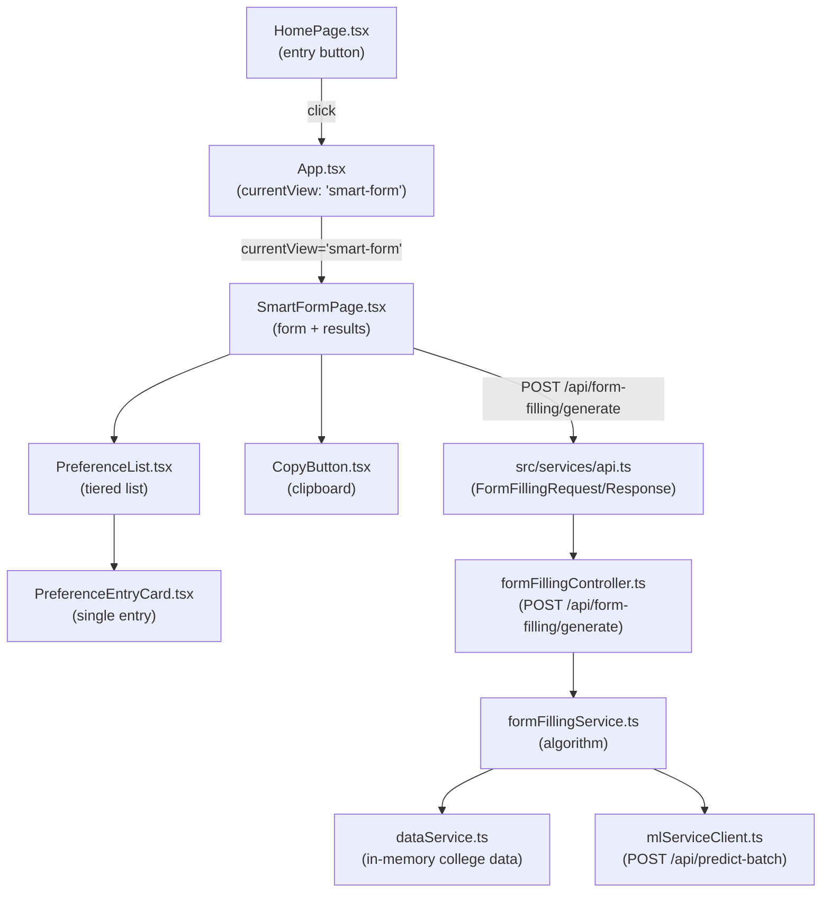
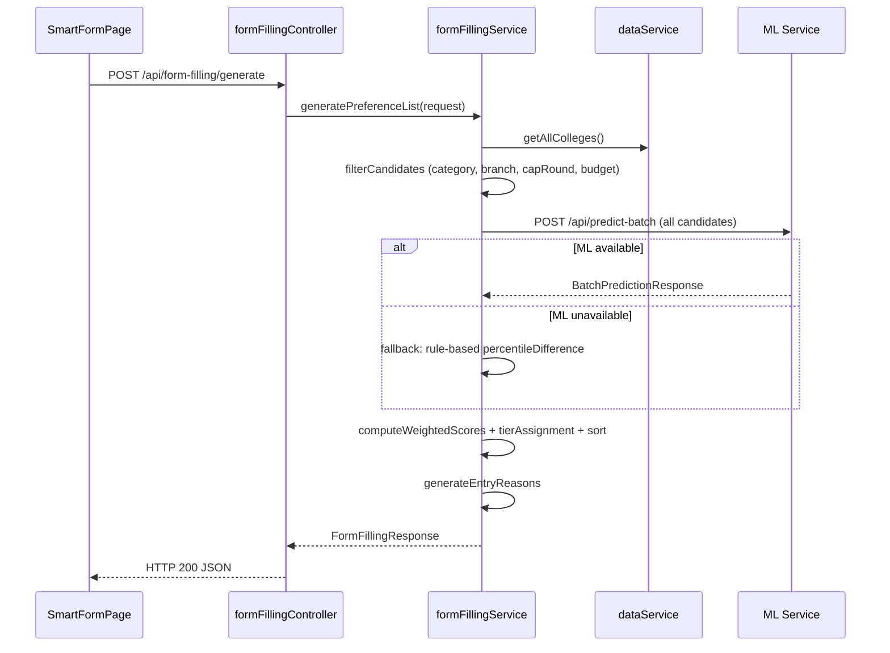

# Design Document: Smart Form Filling Generator

## Overview

This feature adds a dedicated "Smart Form Filling Generator" page to the UniScout MHT-CET platform. During the CAP form filling period, students must submit an ordered preference list of college-branch combinations — the order is critical because students are allotted the highest-preference college they qualify for. This feature generates a personalised, optimally ordered preference list grouped into Safe, Target, and Dream tiers, sorted within each tier by a configurable weighted score that balances admission probability, placement outcome, location preference, and branch preference rank.

The feature spans three layers: a new React page (`SmartFormPage.tsx`) with supporting components, a new Express controller/service pair on the Node.js backend, and integration with the existing ML service (`POST /api/predict-batch`) for admission probability predictions.

---

## Architecture



### Request Flow



### Navigation State Machine

```
home → smart-form → home
home → mht-cet → results → home  (unchanged)
```

`App.tsx` gains `'smart-form'` as a valid `Portal` value. No other navigation paths are affected.

---

## Components and Interfaces

### New Files

```
src/
└── components/
    ├── SmartFormPage.tsx          # input form + results page
    ├── PreferenceList.tsx         # tiered list display
    ├── PreferenceEntryCard.tsx    # single preference entry card
    └── CopyButton.tsx             # clipboard copy with feedback

backend-mhtcet/src/
├── controllers/
│   └── formFillingController.ts  # Express route handler
├── services/
│   └── formFillingService.ts     # algorithm implementation
└── routes/
    └── formFilling.ts            # route registration
```

### Modified Files

- `src/App.tsx` — add `'smart-form'` to `Portal` type, add `SmartFormPage` render branch, add `handleSmartFormNav` handler
- `src/components/HomePage.tsx` — add "Generate Form Filling List" button
- `src/services/api.ts` — add `FormFillingRequest`, `PreferenceEntry`, `FormFillingResponse` interfaces and `api.generateFormFillingList()` method
- `backend-mhtcet/src/app.ts` — register `/api/form-filling` route
- `backend-mhtcet/src/types/index.ts` — add `FormFillingRequest`, `PreferenceEntry`, `FormFillingResponse` types

### App.tsx changes

```typescript
export type Portal = 'home' | 'mht-cet' | 'ssc' | 'results' | 'college-comparison' | 'smart-form';

// New handler
const handleSmartFormNav = () => setCurrentView('smart-form');

// New render branch
{currentView === 'smart-form' && (
  <SmartFormPage onBack={() => setCurrentView('home')} />
)}
```

### SmartFormPage.tsx

```typescript
interface SmartFormPageProps {
  onBack: () => void;
}
```

Internal state:
- `formState: FormFillingRequest` — controlled form values
- `result: FormFillingResponse | null` — API response
- `isLoading: boolean`
- `error: string | null`
- `validationErrors: Record<string, string>` — field-level errors

Layout sections (top to bottom):
1. Header with "Back to Home" button and progress indicator
2. Input form (collapsible once results are shown)
3. Loading indicator (while API call in progress)
4. Error state with "Try Again" button
5. Results summary bar (total count, per-tier counts)
6. ML unavailable banner (conditional)
7. Budget warning banner (conditional)
8. Sticky action bar: `CopyButton` + disabled PDF button
9. `PreferenceList` (Safe → Target → Dream sections)

On successful response, `window.scrollTo({ top: resultsRef.current.offsetTop, behavior: 'smooth' })`.

### PreferenceList.tsx

```typescript
interface PreferenceListProps {
  preferences: PreferenceEntry[];
  tiers: { safe: number; target: number; dream: number };
}
```

Renders three tier sections. Each section has a header with tier label and entry count badge. Tier accent colours:
- Safe Picks: `emerald` (`border-emerald-400/40`, `text-emerald-300`)
- Target Picks: `amber` (`border-amber-400/40`, `text-amber-300`)
- Dream Picks: `red` (`border-red-400/40`, `text-red-300`)

Omits a section entirely when its count is 0.

### PreferenceEntryCard.tsx

```typescript
interface PreferenceEntryCardProps {
  entry: PreferenceEntry;
  tierAccent: 'emerald' | 'amber' | 'red';
}
```

Displays (in order): rank number, college name, branch name, `entryReason` as subtitle, cutoff percentile (1 decimal), admission band label (colour-coded), admission probability %, annual fees. Raw `weightedScore` is NOT rendered.

Admission band colour mapping:
- Safe / Likely → `text-emerald-400`
- Moderate → `text-amber-400`
- Risky → `text-red-400`

### CopyButton.tsx

```typescript
interface CopyButtonProps {
  preferences: PreferenceEntry[];
  disabled?: boolean;
}
```

On click, formats the list as plain text (see Requirement 10.2 format), calls `navigator.clipboard.writeText()`. Shows "List copied to clipboard!" toast for 3 seconds on success, error message on failure. Not rendered when `preferences` is empty.

### formFillingController.ts

```typescript
// POST /api/form-filling/generate
async function generateHandler(req: Request, res: Response): Promise<void>
```

Validates request body against schema (returns 422 on failure), delegates to `formFillingService.generatePreferenceList()`, returns 200 with `FormFillingResponse`.

### formFillingService.ts

```typescript
class FormFillingService {
  async generatePreferenceList(request: FormFillingRequest): Promise<FormFillingResponse>
  private filterCandidates(request: FormFillingRequest): CollegeData[]
  private parseAnnualFees(college: CollegeData): number | null
  private computeComponentScores(college: CollegeData, request: FormFillingRequest, maxAvgPackage: number): ComponentScores
  private computeWeightedScore(scores: ComponentScores): number
  private assignTier(admissionBand: string): 'safe' | 'target' | 'dream' | null
  private sortWithinTier(entries: PreferenceEntry[], tier: string, priorityMode: string): PreferenceEntry[]
  private generateEntryReason(scores: ComponentScores): string
}
```

---

## Data Models

### Frontend (src/services/api.ts)

```typescript
export interface FormFillingRequest {
  percentile: number;
  category: string;
  capRound: string;
  branchPreferences: string[];           // ordered 1st, 2nd, 3rd choice
  budget: number | null;                 // max annual fees in LPA; null = no constraint
  preferredDistricts: string[];          // 0–3 districts
  priorityMode: 'branch-over-college' | 'college-over-branch';
}

export interface PreferenceEntry {
  rank: number;
  collegeName: string;
  branch: string;
  cutoffPercentile: number;
  admissionBand: 'Safe' | 'Likely' | 'Moderate' | 'Risky';
  admissionProbability: number;          // 0–100
  annualFees: number | null;             // LPA
  weightedScore: number;                 // 4 decimal places; NOT displayed to students
  entryReason: string;                   // human-readable explanation
  district: string;
  collegeType: string;
  tier: 'safe' | 'target' | 'dream';
  avgPackage?: string | null;
}

export interface FormFillingResponse {
  preferences: PreferenceEntry[];
  tiers: {
    safe: number;
    target: number;
    dream: number;
  };
  metadata: {
    totalEntries: number;
    generatedAt: string;                 // ISO timestamp
    inputSummary: {
      percentile: number;
      category: string;
      capRound: string;
      priorityMode: string;
    };
    dataVersion: string;
    warning?: string;
    ml_unavailable?: boolean;
  };
}
```

### Backend (backend-mhtcet/src/types/index.ts additions)

```typescript
export interface FormFillingRequest {
  percentile: number;
  category: string;
  capRound: string;
  branchPreferences: string[];
  budget: number | null;
  preferredDistricts: string[];
  priorityMode: 'branch-over-college' | 'college-over-branch';
}

export interface ComponentScores {
  admissionProbability: number;          // 0–100 (divided by 100 in formula)
  placementScore: number;                // 0–1
  locationPreferenceScore: number;       // 0–1
  branchPreferenceRankScore: number;     // 0–1
  collegePrestigeScore: number;          // for tie-breaking and priority mode
}

export interface PreferenceEntry {
  rank: number;
  collegeName: string;
  branch: string;
  cutoffPercentile: number;
  admissionBand: 'Safe' | 'Likely' | 'Moderate' | 'Risky';
  admissionProbability: number;
  annualFees: number | null;
  weightedScore: number;
  entryReason: string;
  district: string;
  collegeType: string;
  tier: 'safe' | 'target' | 'dream';
  avgPackage?: string | null;
}

export interface FormFillingResponse {
  preferences: PreferenceEntry[];
  tiers: { safe: number; target: number; dream: number };
  metadata: {
    totalEntries: number;
    generatedAt: string;
    inputSummary: object;
    dataVersion: string;
    warning?: string;
    ml_unavailable?: boolean;
  };
}
```

### Environment Variables

```
# backend-mhtcet/.env
FORM_FILLING_MAX_ENTRIES=50
# Base scoring weights are shared — see SCORING_WEIGHT_* vars
# Form-filling-specific additional weights:
FORM_FILLING_WEIGHT_LOCATION=0.2
FORM_FILLING_WEIGHT_BRANCH=0.1
```

The base weights (admission probability, placement, prestige) are read from the shared `SCORING_WEIGHT_*` env vars defined in the Shared Scoring Module section of the `college-comparison` design. The form filling feature adds two extra dimensions (location, branch rank) on top of the shared base. The four weights must sum to 1.0; if they do not, the service logs a warning and normalises them.

---

## FormFillingService Algorithm

### Step 1: Candidate Generation

```typescript
// Filter in-memory college data
const candidates = dataService.getAllColleges().filter(college => {
  if (college.capRound !== request.capRound) return false;
  if (!categoryMatches(college.category, request.category)) return false;
  if (!request.branchPreferences.some(bp => branchMatches(bp, college.branchName))) return false;
  return true;
});
```

Uses the same `branchMatches` alias logic from `recommendationService.ts`.

### Step 2: Budget Filter

```typescript
function parseAnnualFees(college: CollegeData): number | null {
  if (!college.fees) return null;
  // fees field is already numeric (parsed from Excel by dataService)
  // Heuristic: if fees > 500000 (5 LPA), treat as 4-year total and divide by 4
  return college.fees > 500000 ? college.fees / 4 : college.fees;
}

// Exclude colleges exceeding budget
const budgetFiltered = request.budget == null
  ? candidates
  : candidates.filter(c => {
      const annual = parseAnnualFees(c);
      return annual == null || annual <= request.budget!;
    });
```

### Step 3: ML Batch Call

```typescript
const mlRequests = budgetFiltered.map(c => ({
  college_code: c.collegeCode,
  branch_name: c.branchName,
  category: c.category,
  cap_round: request.capRound,
  student_percentile: request.percentile,
  district: c.district,
}));

let mlResults: MLPredictionResult[];
let mlUnavailable = false;
try {
  mlResults = await mlServiceClient.predictBatch(mlRequests);
} catch {
  mlUnavailable = true;
  mlResults = budgetFiltered.map(c => fallbackPrediction(c, request.percentile));
}
```

Fallback uses the existing `percentileDifference` → `admissionChance` → approximate probability mapping:
- diff ≥ 3 → 85% (Safe)
- diff ≥ 0 → 60% (Likely)
- diff ≥ -5 → 35% (Moderate)
- diff < -5 → excluded (too far out of reach)

### Step 4: Tier Assignment

```typescript
function assignTier(admissionBand: string, cutoff: number, studentPercentile: number): 'safe' | 'target' | 'dream' | null {
  if (admissionBand === 'Safe' || admissionBand === 'Likely') return 'safe';
  if (admissionBand === 'Moderate') return 'target';
  if (admissionBand === 'Risky') {
    // Only include Dream entries within 5 percentile points
    return (cutoff - studentPercentile) <= 5 ? 'dream' : null;
  }
  return null; // exclude
}
```

Entries returning `null` are excluded from the final list.

### Step 5: Weighted Score Computation

```typescript
// Compute max avg_package across all candidates (before tier assignment)
const maxAvgPackage = Math.max(...allCandidates.map(c => parsePackage(c) ?? 0));

function computeWeightedScore(scores: ComponentScores): number {
  // Base weights from shared scoring module (SCORING_WEIGHT_* env vars)
  const W_PROB = parseFloat(process.env.SCORING_WEIGHT_PROB ?? '0.4');
  const W_PLACE = parseFloat(process.env.SCORING_WEIGHT_PLACEMENT ?? '0.3');
  // Form-filling-specific weights
  const W_LOC = parseFloat(process.env.FORM_FILLING_WEIGHT_LOCATION ?? '0.2');
  const W_BRANCH = parseFloat(process.env.FORM_FILLING_WEIGHT_BRANCH ?? '0.1');

  return (
    (scores.admissionProbability / 100) * W_PROB +
    scores.placementScore * W_PLACE +
    scores.locationPreferenceScore * W_LOC +
    scores.branchPreferenceRankScore * W_BRANCH
  );
}
```

Component score rules:
- `placementScore = avgPackage / maxAvgPackage` (0 when avgPackage is null)
- `locationPreferenceScore = preferredDistricts.length === 0 ? 0.5 : (preferredDistricts.includes(district) ? 1.0 : 0.5)`
- `branchPreferenceRankScore`: 1.0 for rank-1 branch, 0.6 for rank-2, 0.3 for rank-3, 0.0 otherwise

### Step 6: Entry Reason Generation

```typescript
function generateEntryReason(scores: ComponentScores, weights: Weights): string {
  const contributions = [
    { key: 'prob', value: (scores.admissionProbability / 100) * weights.prob, label: 'High admission probability' },
    { key: 'placement', value: scores.placementScore * weights.placement, label: 'Strong placement record' },
    { key: 'location', value: scores.locationPreferenceScore * weights.location, label: 'Preferred location' },
    { key: 'branch', value: scores.branchPreferenceRankScore * weights.branch, label: 'Matches your preferred branch' },
  ];
  const top2 = contributions.sort((a, b) => b.value - a.value).slice(0, 2);
  // Special case: if top factor is prob but probability is low, use "Best available option in your range"
  if (top2[0].key === 'prob' && scores.admissionProbability < 20) {
    return 'Best available option in your range';
  }
  return top2.map(f => f.label).join(' + ');
}
```

### Step 7: Priority Mode Sort (Safe Tier)

```typescript
function sortSafeTier(entries: PreferenceEntry[], priorityMode: string): PreferenceEntry[] {
  if (priorityMode === 'branch-over-college') {
    return entries.sort((a, b) =>
      b.branchPreferenceRankScore - a.branchPreferenceRankScore ||
      b.weightedScore - a.weightedScore
    );
  }
  // college-over-branch
  return entries.sort((a, b) =>
    b.collegePrestigeScore - a.collegePrestigeScore ||
    b.weightedScore - a.weightedScore
  );
}
```

Target and Dream tiers always sort by `weightedScore` descending, then `admissionProbability` descending, then `collegePrestigeScore` descending for ties.

### Step 8: Final Assembly

```typescript
const ordered = [
  ...sortSafeTier(safeEntries, request.priorityMode),
  ...sortByWeightedScore(targetEntries),
  ...sortByWeightedScore(dreamEntries),
].slice(0, maxEntries);

// Assign sequential ranks
ordered.forEach((entry, i) => { entry.rank = i + 1; });
```

---

## Correctness Properties

*A property is a characteristic or behavior that should hold true across all valid executions of a system — essentially, a formal statement about what the system should do. Properties serve as the bridge between human-readable specifications and machine-verifiable correctness guarantees.*

### Property 1: Determinism

*For any* valid `FormFillingRequest`, submitting the same request twice with the same underlying college data and ML predictions should produce `FormFillingResponse` objects with identical `preferences` arrays (same rank assignments, tier assignments, and `weightedScore` values within floating-point tolerance of 0.0001).

**Validates: Requirements 12.1, 12.4**

---

### Property 2: Tier ordering invariant

*For any* `FormFillingResponse`, all entries with `tier === 'safe'` should appear before all entries with `tier === 'target'`, which should appear before all entries with `tier === 'dream'`. No entries from different tiers should be interleaved. Additionally, each entry's `tier` field should match its `admissionBand`: Safe/Likely → safe, Moderate → target, Risky → dream.

**Validates: Requirements 5.1, 5.3**

---

### Property 3: Sequential rank numbers

*For any* `FormFillingResponse` with N entries, the `rank` values should form the sequence [1, 2, 3, ..., N] with no gaps or duplicates.

**Validates: Requirements 5.4**

---

### Property 4: Budget filter correctness

*For any* `FormFillingRequest` with a non-null `budget` value, every `PreferenceEntry` in the response should have `annualFees === null` or `annualFees <= budget`.

**Validates: Requirements 4.1**

---

### Property 5: Annual fees parsing

*For any* college record where `fees` is a positive number, `parseAnnualFees` should return a value ≤ `fees`. When `fees > 500000`, the returned value should equal `fees / 4`. When `fees ≤ 500000`, the returned value should equal `fees`.

**Validates: Requirements 4.2**

---

### Property 6: Weighted score bounds

*For any* `PreferenceEntry`, the `weightedScore` should be in the range [0, 1] (inclusive), since all component scores are in [0, 1] and the weights sum to 1.0.

**Validates: Requirements 6.1**

---

### Property 7: Component scores are correctly computed

*For any* `FormFillingRequest` with non-empty `preferredDistricts` and any college in the response:
- If the college's district is in `preferredDistricts`, its `locationPreferenceScore` should be 1.0; otherwise 0.5.
- If the college's branch matches the 1st-choice branch, `branchPreferenceRankScore` should be 1.0; 2nd-choice → 0.6; 3rd-choice → 0.3; no match → 0.0.
- `placementScore` should equal `avgPackage / maxAvgPackage` (0 when avgPackage is null).

*For any* `FormFillingRequest` with empty `preferredDistricts`, every entry's `locationPreferenceScore` should be 0.5.

**Validates: Requirements 6.2, 6.3, 6.4, 2.7**

---

### Property 8: Entry reason is always non-empty

*For any* `PreferenceEntry` in a valid `FormFillingResponse`, the `entryReason` field should be a non-empty string.

**Validates: Requirements 6.7**

---

### Property 9: Dream tier cutoff constraint

*For any* `PreferenceEntry` with `tier === 'dream'`, the entry's `cutoffPercentile - studentPercentile` should be ≤ 5. No entry with `admissionBand === 'Risky'` and `cutoffPercentile - studentPercentile > 5` should appear in the response.

**Validates: Requirements 5.2**

---

### Property 10: Priority mode sort applies only to Safe tier

*For any* `FormFillingRequest` with `priorityMode === 'branch-over-college'`, Safe tier entries should be sorted by `branchPreferenceRankScore` descending as the primary key. *For any* `FormFillingRequest` with `priorityMode === 'college-over-branch'`, Safe tier entries should be sorted by `collegePrestigeScore` descending as the primary key. In both cases, Target and Dream tier entries should be sorted by `weightedScore` descending regardless of `priorityMode`.

**Validates: Requirements 7.1, 7.2, 7.3**

---

### Property 11: Response serialisation round-trip

*For any* valid `FormFillingResponse`, serialising it to JSON and deserialising it should produce an object with the same `preferences` array length, identical `rank` and `tier` values for each entry, and `weightedScore` values within 0.0001 of the originals.

**Validates: Requirements 12.2**

---

### Property 12: Copy format correctness

*For any* non-empty `preferences` array, the plain-text output produced by the copy function should contain each entry formatted as `"{rank}. {collegeName} — {branch} (Cutoff: {cutoffPercentile}, {admissionBand}, Fees: {annualFees} LPA)"`, with tier headers `"=== SAFE PICKS ==="`, `"=== TARGET PICKS ==="`, `"=== DREAM PICKS ==="` inserted before each tier's entries.

**Validates: Requirements 10.2**

---

### Property 13: Copy button visibility tracks list emptiness

*For any* rendered `SmartFormPage`, the "Copy List" button should be present in the DOM if and only if `preferences.length >= 1`.

**Validates: Requirements 10.5**

---

### Property 14: Input validation rejects invalid percentile

*For any* percentile value outside [0, 100], the `Form_Generator` should display a validation error and prevent form submission. *For any* percentile value within [0, 100], no percentile-related validation error should be shown.

**Validates: Requirements 2.5**

---

### Property 15: Duplicate branch preference validation

*For any* form state where the same branch is selected for more than one preference rank, the `Form_Generator` should display an inline validation error on the duplicate field and prevent form submission.

**Validates: Requirements 2.3**

---

### Property 16: District selection count invariant

*For any* sequence of district selection actions, the number of selected districts should never exceed 3.

**Validates: Requirements 2.4**

---

## Error Handling

| Scenario | Backend behaviour | Frontend behaviour |
|---|---|---|
| Request body fails schema validation | HTTP 422 with structured error listing invalid fields | Display field-level errors inline |
| ML service unavailable / timeout | Fallback to rule-based probability; `ml_unavailable: true` in metadata | Show banner: "Predictions are based on historical cutoff data. ML-enhanced probabilities are temporarily unavailable." |
| Budget filter yields 0 colleges | HTTP 200, empty `preferences`, `warning` in metadata | Display warning prominently above list; show "No matching colleges found" message |
| Budget filter yields < 5 colleges | HTTP 200, `warning` in metadata with count | Display warning prominently above list |
| Network error (fetch fails) | — | Display "Unable to connect. Please check your internet connection and try again." + "Try Again" button |
| API returns non-200 | — | Display error message from response + "Try Again" button |
| Clipboard write fails | — | Display "Could not copy to clipboard. Please select and copy the list manually." |
| `fees` field is null/unparseable | `annualFees: null` in entry | Display "N/A" in fees cell |
| `avg_package` is null for all colleges | All `placementScore = 0`; weighted score still valid | No special UI treatment |
| Weights env vars missing | Use defaults (0.4/0.3/0.2/0.1); log warning | — |
| Weights do not sum to 1.0 | Normalise weights; log warning | — |

---

## Testing Strategy

### Dual Testing Approach

Both unit tests and property-based tests are required. Unit tests cover specific examples, integration points, and edge cases. Property tests verify universal correctness across randomised inputs. Together they provide comprehensive coverage.

### Unit Tests

**`formFillingService.test.ts`** (pure algorithm functions):
- `parseAnnualFees`: verify `fees=120000` → 120000, `fees=600000` → 150000, `fees=null` → null
- `assignTier`: verify all four `admissionBand` values, verify Risky with diff=4 → dream, diff=6 → null
- `generateEntryReason`: verify top-2 factor selection with known component scores
- `computeWeightedScore`: verify formula with known inputs and default weights
- `sortSafeTier`: verify branch-over-college and college-over-branch orderings with known data
- Budget filter: verify colleges with fees > budget are excluded, null budget includes all
- ML fallback: mock ML client to throw, verify fallback probabilities are used and `ml_unavailable: true`
- Empty result: verify HTTP 200 with empty preferences and warning when budget is too restrictive

**`formFillingController.test.ts`**:
- Valid request → 200 with correct response shape
- Missing `percentile` → 422 with field error
- `percentile` out of range → 422
- `branchPreferences` empty array → 422
- `priorityMode` invalid value → 422

**`CopyButton.test.tsx`**:
- Renders when `preferences.length > 0`, not rendered when empty
- Successful clipboard write → shows "List copied to clipboard!" toast
- Failed clipboard write → shows error message
- Verify plain-text format matches specification

**`PreferenceEntryCard.test.tsx`**:
- Renders all required fields (rank, name, branch, cutoff, band, probability, fees, entryReason)
- Does NOT render raw `weightedScore` as visible text
- Correct colour class for each `admissionBand` value

**`SmartFormPage.test.tsx`**:
- Default CAP round is "I"
- Progress indicator updates as fields are filled
- Duplicate branch selection shows validation error
- 4th district selection is prevented
- Loading state disables submit button
- Empty result shows "No matching colleges found" message
- ML unavailable banner shown when `ml_unavailable: true`

### Property-Based Tests

Use **fast-check** (TypeScript). Each test runs a minimum of 100 iterations.

```typescript
// Feature: smart-form-filling, Property 1: Determinism
fc.assert(fc.property(
  arbitraryFormFillingRequest(),
  async (request) => {
    const r1 = await service.generatePreferenceList(request);
    const r2 = await service.generatePreferenceList(request);
    return r1.preferences.every((e, i) =>
      e.rank === r2.preferences[i].rank &&
      e.tier === r2.preferences[i].tier &&
      Math.abs(e.weightedScore - r2.preferences[i].weightedScore) < 0.0001
    );
  }
), { numRuns: 100 });

// Feature: smart-form-filling, Property 2: Tier ordering invariant
fc.assert(fc.property(
  arbitraryFormFillingResponse(),
  (response) => {
    const prefs = response.preferences;
    let lastTierOrder = 0;
    const tierOrder = { safe: 1, target: 2, dream: 3 };
    return prefs.every(e => {
      const order = tierOrder[e.tier];
      if (order < lastTierOrder) return false;
      lastTierOrder = order;
      return true;
    });
  }
), { numRuns: 200 });

// Feature: smart-form-filling, Property 3: Sequential rank numbers
fc.assert(fc.property(
  arbitraryFormFillingResponse(),
  (response) => {
    return response.preferences.every((e, i) => e.rank === i + 1);
  }
), { numRuns: 100 });

// Feature: smart-form-filling, Property 4: Budget filter correctness
fc.assert(fc.property(
  fc.float({ min: 0.5, max: 20 }),
  arbitraryFormFillingRequest(),
  async (budget, baseRequest) => {
    const request = { ...baseRequest, budget };
    const response = await service.generatePreferenceList(request);
    return response.preferences.every(e =>
      e.annualFees == null || e.annualFees <= budget
    );
  }
), { numRuns: 100 });

// Feature: smart-form-filling, Property 6: Weighted score bounds
fc.assert(fc.property(
  arbitraryFormFillingResponse(),
  (response) => {
    return response.preferences.every(e =>
      e.weightedScore >= 0 && e.weightedScore <= 1
    );
  }
), { numRuns: 100 });

// Feature: smart-form-filling, Property 8: Entry reason is always non-empty
fc.assert(fc.property(
  arbitraryFormFillingResponse(),
  (response) => {
    return response.preferences.every(e =>
      typeof e.entryReason === 'string' && e.entryReason.length > 0
    );
  }
), { numRuns: 100 });

// Feature: smart-form-filling, Property 9: Dream tier cutoff constraint
fc.assert(fc.property(
  arbitraryFormFillingRequest(),
  async (request) => {
    const response = await service.generatePreferenceList(request);
    return response.preferences
      .filter(e => e.tier === 'dream')
      .every(e => e.cutoffPercentile - request.percentile <= 5);
  }
), { numRuns: 100 });

// Feature: smart-form-filling, Property 11: Response serialisation round-trip
fc.assert(fc.property(
  arbitraryFormFillingResponse(),
  (response) => {
    const serialised = JSON.parse(JSON.stringify(response)) as FormFillingResponse;
    return serialised.preferences.length === response.preferences.length &&
      serialised.preferences.every((e, i) =>
        e.rank === response.preferences[i].rank &&
        e.tier === response.preferences[i].tier &&
        Math.abs(e.weightedScore - response.preferences[i].weightedScore) < 0.0001
      );
  }
), { numRuns: 100 });

// Feature: smart-form-filling, Property 16: District selection count invariant
fc.assert(fc.property(
  fc.array(fc.constantFrom(...maharashtraDistricts), { minLength: 1, maxLength: 10 }),
  (clickSequence) => {
    let selected: string[] = [];
    for (const district of clickSequence) {
      selected = toggleDistrict(selected, district);
    }
    return selected.length <= 3;
  }
), { numRuns: 200 });
```

Each property test must reference its design property via a comment tag:
`// Feature: smart-form-filling, Property N: <property_text>`
